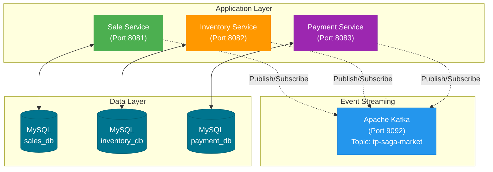

# Saga Pattern Example - Choreography

[](https://github.com/naive/saga-pattern-example/actions/workflows/test.yml)

Microservices implementation using the Saga Pattern with choreography approach. This project demonstrates event-driven architecture using Apache Kafka for communication between services.

## Architecture



### Services

- **Sale Service**: Manages order creation and coordinates the saga workflow
- **Inventory Service**: Handles inventory reservation and compensation (rollback)
- **Payment Service**: Processes payments and refunds
- **Apache Kafka**: Event streaming platform for asynchronous inter-service communication
- **MySQL Databases**: Each service has its own isolated database (database-per-service pattern)

## Quick Start

### Prerequisites

- Docker and Docker Compose
- **Just** command runner - [Installation](https://github.com/casey/just#installation)
- Java 17+ (if running locally without Docker)

### Docker Compose Architecture

**Files:**
- `compose.yml` - Development (ports 8081-8083, persistent DBs)
- `compose.test.yml` - Testing (ports 8091-8093, ephemeral DBs)

**Both environments can run simultaneously without conflicts**

### 1. Configure Environment Variables

Copy the example environment file and adjust if needed:

```bash
cp .env.example .env
```

The `.env` file contains database configuration for all three services (sale, inventory, payment).

**Environment Variables:**

```bash
# Kafka Configuration
KAFKA_TOPIC=tp-saga-market               # Kafka topic name for saga events

# Sale Service Database
SALE_DB_NAME=sales_db                    # Database name
SALE_DB_ROOT_PWD=root                    # MySQL root password
SALE_DB_APP_USERNAME=sales_app_user      # Application user
SALE_DB_APP_USER_PWD=123456             # Application password

# Inventory Service Database
INVENTORY_DB_NAME=inventory_db
INVENTORY_DB_ROOT_PWD=root
INVENTORY_DB_APP_USERNAME=inventory_app_user
INVENTORY_DB_APP_USER_PWD=123456

# Payment Service Database
PAYMENT_DB_NAME=payment_db
PAYMENT_DB_ROOT_PWD=root
PAYMENT_DB_APP_USERNAME=payment_app_user
PAYMENT_DB_APP_USER_PWD=123456
```

**Note:** The `.env` file is gitignored. Always use `.env.example` as a template and never commit `.env` to version control.

### 2. Build and Start the Application

#### Using Just (Recommended)

```bash
# Start all services (infrastructure + applications)
just up

# Or use Docker Compose directly
docker compose up -d
```

#### Using Docker Compose Manually

```bash
# Build all images
docker compose build

# Start all services
docker compose up -d

# Or step by step
docker compose build                    # Build all images
docker compose up -d kafka-service kafka-ui  # Start Kafka infrastructure
docker compose up -d sale-db-service inventory-db-service payment-db-service  # Start databases
docker compose up -d sale-service inventory-service payment-service  # Start applications
```

### 3. Verify Services are Running

```bash
# Check service status
docker compose ps
```

**Note:** Kafka topics are automatically created when the services start publishing/consuming messages. They are persisted in the `kafka-data` volume.

### 4. Access the Services

#### Service Endpoints

**Important:** These are REST APIs without web interfaces. Access them using curl, Postman, or similar HTTP clients.

```bash
# Display all endpoints and example API calls
just api-doc
```

**Available Services:**

| Service | Port | Type | Description |
|---------|------|------|-------------|
| Sale Service | 8081 | REST API | Sales creation endpoint (POST /api/v1/sales) |
| Inventory Service | 8082 | Event-Driven | Listens to Kafka topics for inventory operations |
| Payment Service | 8083 | Event-Driven | Listens to Kafka topics for payment operations |
| Kafbat UI | 8181 | Web UI | Open-source Kafka management interface (Apache 2.0) |
| Kafka Broker | 9092 | TCP | Kafka broker for client connections |

#### Example API Calls

```bash
# Create a new sale (triggers the saga)
curl -X POST http://localhost:8081/api/v1/sales \
  -H "Content-Type: application/json" \
  -d '{
    "userId": 1,
    "productId": 1,
    "quantity": 2,
    "value": 99.90
  }'

# Open Kafbat UI to monitor Kafka messages in real-time
just kafka-ui
# Then navigate to http://localhost:8181 in your browser

# View sale service logs to see saga execution
docker compose logs -f sale-service

# View all services logs
just logs-app
```

**Important Notes:**
- **Sale Service** is the only service with REST endpoints (POST only)
- **Inventory and Payment Services** are event-driven - they listen to Kafka topics and respond via events
- If you access http://localhost:8081 directly in a browser, you'll see a "Whitelabel Error Page" (404) because there's no root endpoint or HTML interface - this is expected behavior for REST APIs

## Just Commands

Run `just` (or `just --list`) to see all available commands:

### General Commands
- `just up` - Start all services (infrastructure + applications)
- `just down` - Stop all services
- `just restart` - Restart all services
- `just reset` - Complete reset: clean, rebuild, and start fresh

### Cleanup Commands
- `just clean` - Clean all application resources (dev, test, volumes, images, cache)

### Monitoring & Logs
- `just logs` - Show logs from all services
- `just logs-infra` - Show logs from infrastructure services only
- `just logs-app` - Show logs from application services only

### Kafka Commands
- `just kafka-ui` - Open Kafbat UI in browser
- `just kafka-show-messages` - Show Kafka messages from development environment
- `just kafka-show-messages-test` - Show Kafka messages from test environment (used by demo)

### Testing & Demo
- `just demo` - Run interactive demo (resets environment with confirmation)
- `just test` - Run automated integration test suite (CI/CD ready)

### Database Commands
- `just db-show` - Show all database data (development)
- `just db-show-test` - Show all database data (test)

### Documentation
- `just api-doc` - Display all service endpoints and example API calls

## Project Structure

```
saga-pattern-example/
├── saga-choreography/
│   ├── sale-service/           # Sale microservice
│   │   ├── src/
│   │   ├── pom.xml
│   │   └── Dockerfile
│   ├── inventory-service/      # Inventory microservice
│   │   ├── src/
│   │   ├── pom.xml
│   │   └── Dockerfile
│   └── payment-service/        # Payment microservice
│       ├── src/
│       ├── pom.xml
│       └── Dockerfile
├── docker/
│   ├── database/               # Database Dockerfile and scripts
│   └── kafka/                  # Kafka entrypoint script
├── scripts/                    # Automation scripts
│   └── demo-saga.sh           # Interactive demo script
├── tests/                      # Test suites
│   └── integration/           # Integration tests
│       └── integration-test.sh # Automated integration test suite
├── .env                        # Environment variables (gitignored)
├── .env.example                # Environment variables template
├── compose.yml                 # Docker Compose (dev environment)
├── compose.test.yml            # Docker Compose (test environment)
├── .justfile                   # Just command runner recipes
└── README.md
```

## Data Persistence

The application uses Docker volumes to persist data across container restarts:

### Volumes (Development Environment)

| Volume Name | Purpose | Data Stored |
|-------------|---------|-------------|
| `kafka-data` | Kafka data | Kafka topics, messages, and metadata (KRaft mode) |
| `sales-db-volume` | Sale service database | Sales data and transactions |
| `inventory-db-volume` | Inventory service database | Inventory data |
| `payment-db-volume` | Payment service database | Payment data |

**Important:**
- Volumes persist data even when containers are stopped or removed
- Kafka uses KRaft mode (no Zookeeper required) with metadata stored in `kafka-data` volume
- Test environment uses ephemeral storage (no volumes - fresh state every run)
- To completely reset the system, use `just clean` which removes all volumes

## Configuration

### Environment Variables

The application uses environment variables to configure database and Kafka connections. These variables are defined in the `.env` file and used by Docker Compose.

#### Database Configuration Variables

Each service has its own database with the following configurable parameters:

| Variable | Description | Default Value | Used By |
|----------|-------------|---------------|---------|
| `SALE_DB_NAME` | Sale service database name | `sales_db` | Sale DB |
| `SALE_DB_ROOT_PWD` | Sale DB root password | `root` | Sale DB |
| `SALE_DB_APP_USERNAME` | Sale DB application user | `sales_app_user` | Sale DB |
| `SALE_DB_APP_USER_PWD` | Sale DB application password | `123456` | Sale DB |
| `INVENTORY_DB_NAME` | Inventory service database name | `inventory_db` | Inventory DB |
| `INVENTORY_DB_ROOT_PWD` | Inventory DB root password | `root` | Inventory DB |
| `INVENTORY_DB_APP_USERNAME` | Inventory DB application user | `inventory_app_user` | Inventory DB |
| `INVENTORY_DB_APP_USER_PWD` | Inventory DB application password | `123456` | Inventory DB |
| `PAYMENT_DB_NAME` | Payment service database name | `payment_db` | Payment DB |
| `PAYMENT_DB_ROOT_PWD` | Payment DB root password | `root` | Payment DB |
| `PAYMENT_DB_APP_USERNAME` | Payment DB application user | `payment_app_user` | Payment DB |
| `PAYMENT_DB_APP_USER_PWD` | Payment DB application password | `123456` | Payment DB |

#### Application Configuration

Each Spring Boot service uses the following environment variables (set by Docker Compose):

| Variable | Description | Value in Docker | Local Development |
|----------|-------------|-----------------|-------------------|
| `SPRING_DATASOURCE_URL` | JDBC connection URL | `jdbc:mysql://<service>:3306/<db>` | `jdbc:mysql://localhost:330X/<db>` |
| `SPRING_DATASOURCE_USERNAME` | Database username | From `.env` | From `application.yaml` |
| `SPRING_DATASOURCE_PASSWORD` | Database password | From `.env` | From `application.yaml` |
| `SPRING_KAFKA_BOOTSTRAP_SERVERS` | Kafka broker address | `kafka:29092` | `localhost:9092` |

**Note:** The `application.yaml` files use Spring Boot's property placeholder syntax `${VAR:default}` to support both Docker and local development environments.

### Kafka Topics

The application uses a single topic for saga orchestration:

| Topic Name | Partitions | Replication Factor | Purpose |
|------------|------------|-------------------|---------|
| `tp-saga-market` | 3 | 1 | Saga orchestration events for order processing |

**Consumer Groups:**
- `inventory-credit` - Inventory service (credit operations)
- `inventory-debit` - Inventory service (debit operations)
- `payment` - Payment service
- `sale-cancel` - Sale service (cancellation handling)

## Development

### Building Services Locally

```bash
# Build a specific service (requires Maven installed)
cd saga-choreography/sale-service
mvn clean package

# Run locally (requires local MySQL and Kafka)
mvn spring-boot:run
```

**Note:** The project does not include Maven Wrapper files. Install Maven:
- macOS: `brew install maven`
- Linux: `sudo apt install maven` (Debian/Ubuntu) or `sudo yum install maven` (RHEL/CentOS)
- Or download from [maven.apache.org](https://maven.apache.org/)

### Hot Reload During Development

```bash
# Rebuild specific service
docker compose build sale-service

# Restart specific service
docker compose restart sale-service
```

## Testing the Saga Pattern

### 🎬 Interactive Demo (RECOMMENDED)

**The best way to understand the Saga Pattern is through our interactive demonstration!**

This guided demo walks you through each scenario with:
- 📊 Real-time database state visualization
- 🔍 Step-by-step explanations of Saga Pattern principles
- ⏸️ Pauses for observation and exploration
- 📨 Visible event flows through Kafka
- 🎓 Educational content explaining WHY this is a Saga Pattern

```bash
# Run the interactive demo
just demo

# Or directly
./scripts/demo-saga.sh
```

**What you'll learn:**
1. **Distributed Transactions** - How Saga breaks them into local transactions
2. **Event-Driven Choreography** - Services coordinating through Kafka events
3. **Semantic Locks** - Business-level validations and early failure detection
4. **Compensating Transactions** - The core of Saga Pattern (backward recovery)
5. **Eventual Consistency** - BASE vs ACID trade-offs

Each scenario demonstrates a key characteristic of the Saga Pattern with before/after database states and detailed explanations.

---

### 🧪 Automated Test Suite (CI/CD Ready)

```bash
# Run full automated test suite
just test

# What happens:
# 1. Spins up isolated test environment (compose.test.yml)
# 2. Waits for services health
# 3. Runs 6 test scenarios
# 4. Verifies saga behavior (success, failures, compensation)
# 5. Cleans up automatically
```

**Test Scenarios:**
1. ✅ **Successful Purchase** - Happy path with balance and inventory checks
2. ❌ **Insufficient Stock** - Immediate rejection, no compensation needed
3. 🔄 **Insufficient Balance** - Saga compensation (inventory rollback)
4. ✅ **Another Successful Purchase** - Validates consistent behavior
5. 🔀 **Concurrent Transactions** - Tests eventual consistency
6. ✔️ **System Consistency** - Verifies no pending transactions

**Notes:**
- The test suite automatically starts a fresh test environment
- All containers and volumes are cleaned up after tests complete
- Test environment runs on different ports (8091-8093) to avoid conflicts with dev environment

**Database Initialization:**

The project uses separate database initialization files for development and testing:

- **Development** (`compose.yml`):
  - `docker/database/init-user-db.sql` - User data (modify as needed)
  - `docker/database/init-inventory-db.sql` - Product inventory (modify as needed)

- **Testing** (`compose.test.yml`, used by `just demo` and `just test`):
  - `docker/database/init-user-db.test.sql` - Fixed test users (do not modify)
  - `docker/database/init-inventory-db.test.sql` - Fixed test products (do not modify)

Test scripts (`demo-saga.sh` and `integration-test.sh`) depend on the fixed test data. You can freely modify development init files without breaking tests.

---

### Manual Testing

#### Execute Test Scenarios

**Scenario 1: Successful Purchase** ✅
```bash
# Cristiano buys 2 products (has R$ 1,000 - enough balance)
curl -X POST http://localhost:8081/api/v1/sales \
  -H "Content-Type: application/json" \
  -d '{
    "userId": 1,
    "productId": 6,
    "quantity": 2,
    "value": 200.00
  }'

# Expected result: FINALIZED
# Inventory: 10 → 8 units
# Balance: R$ 1,000 → R$ 800
```

**Scenario 2: Insufficient Stock** ❌
```bash
# Rodrigo tries to buy 10 products (only 5 available)
curl -X POST http://localhost:8081/api/v1/sales \
  -H "Content-Type: application/json" \
  -d '{
    "userId": 2,
    "productId": 7,
    "quantity": 10,
    "value": 300.00
  }'

# Expected result: CANCELED
# Inventory: unchanged (5 units)
# Balance: unchanged
```

**Scenario 3: Insufficient Balance (with Compensation)** 🔄
```bash
# Rodrigo tries to buy for R$ 600 (only has R$ 500)
curl -X POST http://localhost:8081/api/v1/sales \
  -H "Content-Type: application/json" \
  -d '{
    "userId": 2,
    "productId": 6,
    "quantity": 3,
    "value": 600.00
  }'

# Expected result: CANCELED with COMPENSATION
# Inventory: 10 → 7 → 10 (debited then credited back)
# Balance: unchanged (R$ 500)
```

#### Monitor Saga Execution

```bash
# Watch all services logs
just logs-app

# Or watch specific services
docker compose logs -f sale-service inventory-service payment-service

# View Kafka messages in Kafbat UI
just kafka-ui
# Navigate to http://localhost:8181 → Topics → tp-saga-market

# Or consume messages directly from terminal
just kafka-show-messages
```

#### Verify Results

```bash
# Check all databases (formatted output)
just db-show

# Or manually check specific databases
docker exec -it sale-db mysql -u root -proot sales_db \
  -e "SELECT id, user_id, product_id, quantity, value, status FROM sale ORDER BY id DESC LIMIT 5;"

docker exec -it inventory-db mysql -u root -proot inventory_db \
  -e "SELECT product_id, quantity FROM inventories;"

docker exec -it payment-db mysql -u root -proot payment_db \
  -e "SELECT * FROM payments;" \
  -e "SELECT id, name, balance FROM users;"
```

---

### Understanding the Saga Flow

The choreography saga works as follows:

**Happy Path (Success):**
1. **Sale Service** receives POST request → Creates sale (status: `PENDING`)
2. **Sale Service** publishes `CREATED_SALE` event to Kafka
3. **Inventory Service** listens to `CREATED_SALE`
   - Checks stock availability
   - Debits inventory
   - Publishes `UPDATED_INVENTORY` event
4. **Payment Service** listens to `UPDATED_INVENTORY`
   - Checks user balance
   - Debits balance
   - Creates payment record
   - Publishes `VALIDATED_PAYMENT` event
5. **Sale Service** listens to `VALIDATED_PAYMENT`
   - Updates sale status to `FINALIZED`

**Failure Scenarios:**

- **Insufficient Stock:**
  - Inventory Service publishes `ROLLBACK_INVENTORY`
  - Sale Service cancels sale (status: `CANCELED`)

- **Insufficient Balance (with Compensation):**
  - Payment Service publishes `FAILED_PAYMENT`
  - Inventory Service **credits back** the reserved stock (compensation)
  - Sale Service cancels sale (status: `CANCELED`)
