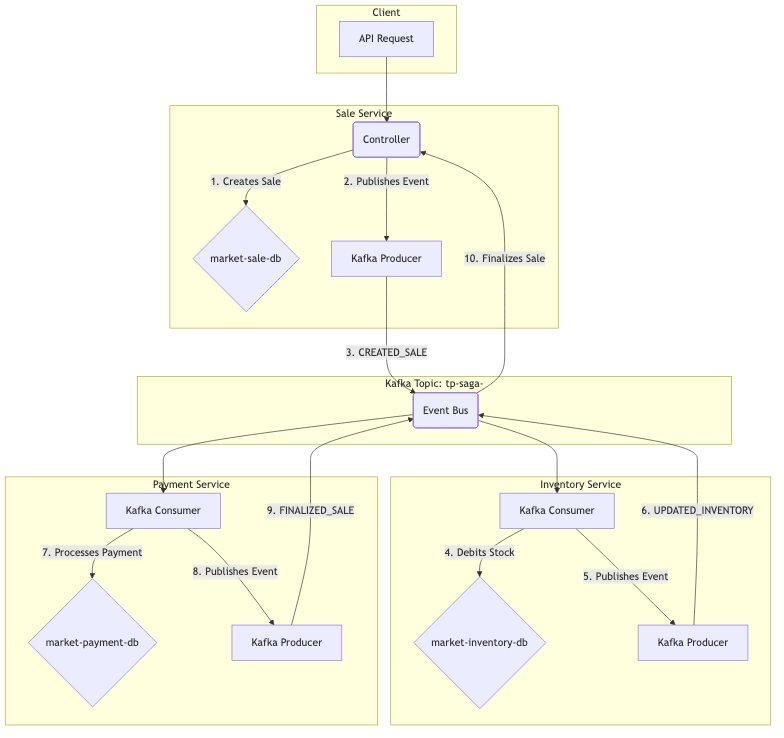
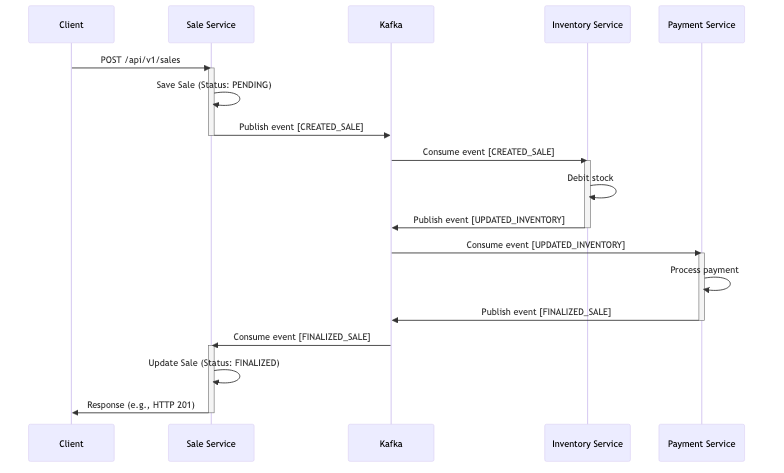
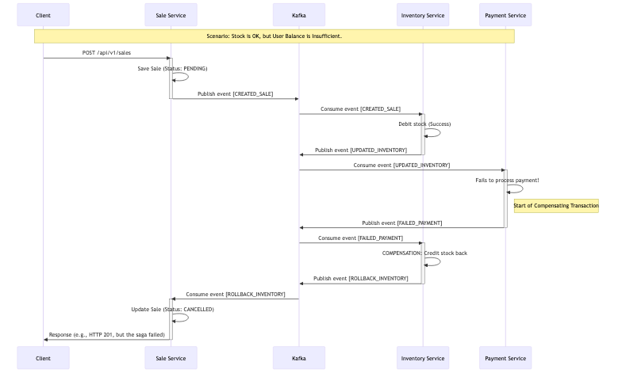

# Practical Guide: Implementing the Saga Pattern

## 1. Objective

The purpose of this document is to provide a practical and educational guide for developers looking to understand and implement the **Saga** design pattern. By analyzing a functional Proof of Concept (POC), we will explore the theoretical concepts and practical challenges of maintaining data consistency in a microservices architecture.

By the end of this guide, you will be able to:

- Understand the problems that the Saga pattern aims to solve.
- Differentiate between the Choreography and Orchestration approaches.
- Analyze how microservices can communicate asynchronously using a message broker like Apache Kafka.
- Implement distributed business transactions and their corresponding compensating actions to handle failures.

---

## 2. The Saga Design Pattern

### 2.1. What is it and why use it?

In a microservices architecture, it is common for a single business transaction to need to update data across multiple services. For example, an e-commerce order might need to:

1.  Reserve the item in the **inventory** service.
2.  Process the payment in the **payments** service.
3.  Create the order in the **sales** service.

The challenge here is: how to ensure data consistency across these services? We cannot simply use a traditional database transaction (ACID) that spans multiple databases, as this would violate one of the fundamental principles of microservices: the decoupling and autonomy of each service.

This is where the **Saga** pattern comes in.

A Saga is a sequence of local transactions where each transaction updates the database of a single service and publishes an event or message to trigger the next step of the transaction. If a local transaction fails for any reason, the Saga executes a series of **compensating transactions** to revert or undo the previous transactions, thus ensuring that the system returns to a consistent state.

### 2.2. Implementation Types

There are two main ways to coordinate a Saga:

#### Choreography

In this model, there is no central coordinator. Each service participating in the Saga publishes events that are listened to by other services. It is a decentralized approach: a service finishes its transaction and publishes an event, and the next service knows to start its part of the work upon receiving this event.

-   **Advantages:**
    -   **Simplicity:** No single point of failure or an extra service to manage.
    -   **Decoupling:** Services do not need to know about each other, only the events they emit and consume.
-   **Disadvantages:**
    -   **Traceability:** It can be difficult to understand the flow of a business transaction, as the logic is distributed among several services.
    -   **Cyclic Complexity:** Adding new steps to the Saga can become complex, with the risk of creating cyclic dependencies between services.

> **Note:** The POC in this project uses the Choreography approach, which is an excellent way to visualize this pattern in action.

#### Orchestration

In this model, a central service, the **Orchestrator**, is responsible for telling each participant what to do. The orchestrator manages the entire sequence of transactions and compensating actions. If something fails, it is the orchestrator that commands the reversal of operations.

-   **Advantages:**
    -   **Visibility and Control:** The transaction logic is centralized, making it easier to understand, debug, and modify the flow.
    -   **Simplified Management:** The compensation logic is not distributed; it is handled by the orchestrator.
-   **Disadvantages:**
    -   **Single Point of Failure:** The orchestrator is a critical component.
    -   **Tighter Coupling:** The participating services are coupled to the orchestrator.

### 2.3. Compensating Transactions

A compensating transaction is the "key" to the resilience of the Saga pattern. For every step of the Saga that can be reversed, there must be a corresponding action that nullifies its effect.

| Action                | Compensating Action      |
| --------------------- | ------------------------ |
| Debit amount from user| Credit amount to user    |
| Reserve stock         | Release stock            |
| Create order          | Cancel order             |

It is crucial that compensating actions are also **idempotent** and can be retried in case of failure, ensuring that the system eventually reaches a consistent state.

---

## 3. Analyzing the POC: Saga with Choreography in Action

Now that we understand the theory, let's see how it applies in practice. The Proof of Concept (POC) simulates a simple sales operation, involving three microservices that communicate asynchronously via Apache Kafka to orchestrate the saga.

### 3.1. Architecture Overview

The solution's architecture consists of three main microservices, a message broker (Kafka), and dedicated databases for each service, ensuring full autonomy and decoupling.



*   **Main Flow (Happy Path):** The diagram above illustrates the flow of events when a sale is successful.
*   **Compensation Flow:** In case of failure (e.g., payment declined or out of stock), a failure event is published to the same topic, triggering compensating actions in the previous services.

### 3.2. The Microservices

Each microservice in the POC has a unique responsibility and an isolated database.

-   **`sale-service`**:
    -   **Responsibility:** It is the entry point of the transaction. Responsible for creating the sale, managing its state (`PENDING`, `FINALIZED`, `CANCELLED`), and orchestrating the start and end of the saga.
    -   **Database:** Manages the `Sale` entity.

-   **`payment-service`**:
    -   **Responsibility:** Listens for the sale creation event and processes the payment. It checks the user's balance and, if sufficient, debits the amount.
    -   **Database:** Manages the `User` and `Payment` entities.

-   **`inventory-service`**:
    -   **Responsibility:** Listens for the successful payment event and debits the product from the stock.
    -   **Database:** Manages the `Inventory` entity.

### 3.3. Communication with Apache Kafka

Communication between the microservices is done asynchronously through Apache Kafka. Let's analyze the configurations at two levels: the Kafka infrastructure (defined in `compose.yml`) and the Kafka client configuration in each microservice (defined in `application.yaml`).

#### 3.3.1. Kafka Service Configuration (`compose.yml`)

The `kafka-service` in the `compose.yml` file is responsible for starting the Kafka broker. The environment variables (`environment`) are crucial for its operation:

```yaml
# compose.yml (kafka-service snippet)
environment:
  # KRaft Mode: Runs Kafka without the ZooKeeper dependency.
  KAFKA_NODE_ID: 1
  KAFKA_PROCESS_ROLES: broker,controller
  KAFKA_CONTROLLER_QUORUM_VOTERS: 1@kafka:9093

  # Listeners: Defines how Kafka "listens" for connections.
  KAFKA_LISTENERS: CONTROLLER://kafka:9093,INTERNAL://0.0.0.0:29092,EXTERNAL://0.0.0.0:9092
  KAFKA_ADVERTISED_LISTENERS: INTERNAL://kafka:29092,EXTERNAL://localhost:9092
  KAFKA_LISTENER_SECURITY_PROTOCOL_MAP: CONTROLLER:PLAINTEXT,INTERNAL:PLAINTEXT,EXTERNAL:PLAINTEXT
  KAFKA_INTER_BROKER_LISTENER_NAME: INTERNAL

  # Single Node Replication Settings
  KAFKA_OFFSETS_TOPIC_REPLICATION_FACTOR: 1
  KAFKA_TRANSACTION_STATE_LOG_REPLICATION_FACTOR: 1
  KAFKA_TRANSACTION_STATE_LOG_MIN_ISR: 1

  # Development Settings
  KAFKA_AUTO_CREATE_TOPICS_ENABLE: 'true'
```

-   **`KAFKA_PROCESS_ROLES`**: Defines that this node will act as both a `broker` (storing data) and a `controller` (managing the cluster). Essential for KRaft mode on a single node.
-   **`KAFKA_LISTENERS`**: Configures the network sockets that Kafka will open.
    -   `INTERNAL://0.0.0.0:29092`: A listener for communication **inside** the Docker network. The other containers (microservices) will connect to Kafka through this port.
    -   `EXTERNAL://0.0.0.0:9092`: A listener for communication **outside** the Docker network. This is why we can connect to port `9092` from our host machine.
-   **`KAFKA_ADVERTISED_LISTENERS`**: Informs clients how they should connect to Kafka.
    -   `INTERNAL://kafka:29092`: Tells clients *inside* Docker to use the hostname `kafka` and port `29092`.
    -   `EXTERNAL://localhost:9092`: Tells clients *outside* Docker (like an application on your machine) to use `localhost` and port `9092`.
-   **`KAFKA_INTER_BROKER_LISTENER_NAME`**: Specifies that communication between brokers (in this case, only one) should use the `INTERNAL` listener.
-   **`KAFKA_OFFSETS_TOPIC_REPLICATION_FACTOR: 1`**: Defines the replication factor for the internal Kafka topic that stores consumer offsets. Since we only have one broker, the value must be `1`. In a cluster with multiple brokers, a higher value (e.g., `3`) would ensure the durability of this data even if a broker fails.
-   **`KAFKA_AUTO_CREATE_TOPICS_ENABLE: 'true'`**: A very useful setting for development. It allows topics to be created automatically when a producer tries to send a message to a topic that does not yet exist. In production, this is usually set to `false` for stricter control.

#### 3.3.2. Kafka Client Configuration (`application.yaml`)

Now, let's analyze how the microservices (Kafka clients) are configured. In addition to the custom properties in `application-config`, Spring Boot manages other important settings.

**Example (`sale-service/src/main/resources/application.yaml` and Spring settings):**
```yaml
# application.yaml
application-config:
  kafka:
    server-url: ${SPRING_KAFKA_BOOTSTRAP_SERVERS:localhost:9092}
    auto-offset-reset: "earliest"
    topic: ${KAFKA_TOPIC:tp-saga-market}
    producer:
      group-id: "send-sale" # Used for identification/logging
    consumer:
      group-id:
        finalize: "finalize-sale"
        cancel: "cancel-sale"
```

-   **`server-url`**: Points to the Kafka broker. Note that in `compose.yml`, the `SPRING_KAFKA_BOOTSTRAP_SERVERS` for the services is `kafka:29092`, using the internal Docker listener. The value `localhost:9092` is just a fallback for local execution outside of Docker.
-   **`auto-offset-reset: "earliest"`**: This is an extremely important consumer setting. It dictates what to do when a consumer connects for the first time (or after a long time offline) and there is no saved *offset* (pointer to the last read message) for it.
    -   **`earliest` (used in the POC):** The consumer will start reading from the **beginning** of the topic. This is great for ensuring no messages are lost, even if the consumer was offline when the message was sent.
    -   **`latest` (default):** The consumer will start reading only the **new** messages that arrive after it connects. Messages sent while it was offline would be ignored.
-   **`consumer.group-id`**: Identifies a group of consumers.
    -   **`finalize: "finalize-sale"`** and **`cancel: "cancel-sale"`**: The `sale-service` has two distinct consumers, each with its own `group-id`. This means that both will receive **all messages** from the `tp-saga-market` topic. Each consumer then internally filters the message that interests it (whether to finalize or cancel the sale). This is a strategy to allow a single service to react to multiple different events within the same saga.
-   **Serializers and Deserializers (`(De)Serializer`)**: Although not explicit in the POC's `application.yaml` (they are configured via Spring configuration classes), they are fundamental and will be detailed in the next section.

#### 3.3.3. Custom Serializers and Deserializers

For Java objects (POJOs) to be transported through Kafka, they need to be converted into bytes (serialized) and then converted back from bytes to objects (deserialized). The POC uses custom implementations to handle the conversion to JSON format, which offers readability and flexibility.

-   **`CustomSerializer`**: This class is responsible for converting the message object (e.g., `SaleMessageDTO`) into a byte array.
    -   **How it works:** It uses the **Jackson (`ObjectMapper`)** library to transform the Java object into a JSON string. Then, this string is converted to bytes in the `UTF-8` standard.
    -   **Important configuration:** `SerializationFeature.WRITE_DATES_AS_TIMESTAMPS` is disabled to ensure that dates are serialized in a readable string format (like `2023-10-27T10:00:00Z`) instead of a number (timestamp).

-   **`CustomDeserializer`**: Does the reverse job on the consumer side.
    -   **How it works:** It receives a byte array from Kafka, converts it to a `UTF-8` string, and then uses `ObjectMapper` to "map" the JSON string back to an instance of the corresponding Java object (e.g., `SaleMessageDTO`).
    -   **Null Handling:** The implementation checks if the received data is null or empty, returning `null` to avoid deserialization errors on empty messages.
    -   **Time Module:** Both register the `JavaTimeModule`, which is essential for Jackson to correctly serialize and deserialize Java 8+ date and time types (like `LocalDateTime`).

This approach of serializing to JSON is very common in distributed systems, as it facilitates debugging (messages in Kafka are human-readable) and interoperability between services that may be written in different languages.

#### 3.3.4. Programmatic Configuration of Producer and Consumer (Spring Kafka)

In addition to the settings in `application.yaml`, the integration between Spring Boot and Kafka is refined through Java configuration classes. They create the necessary "beans" for the application to produce and consume messages efficiently.

-   **`KafkaSaleProducerConfig.java`**: Configures how the application will send messages.
    -   **`ProducerFactory`**: It is the heart of the producer configuration. It defines the essential properties for connecting and sending messages to Kafka.
        -   `BOOTSTRAP_SERVERS_CONFIG`: Address of the Kafka broker, injected from `application.yaml`.
        -   `KEY_SERIALIZER_CLASS_CONFIG`: Defines the serializer for the message *key*. The POC uses `StringSerializer`, meaning the key is a simple string.
        -   `VALUE_SERIALIZER_CLASS_CONFIG`: Defines the serializer for the message *value* (the body). This is where `CustomSerializer.class` (discussed earlier) is connected, ensuring the `SaleMessageDTO` object is converted to JSON.
    -   **`KafkaTemplate`**: It is a Spring "helper" that simplifies sending messages. It encapsulates the producer logic and offers convenient methods like `send(topic, message)`. The `KafkaTemplate` is injected into services that need to publish events.

-   **`KafkaSaleConsumerConfig.java`**: Configures how the application will receive messages.
    -   **`@EnableKafka`**: This annotation is crucial. It enables the detection of `@KafkaListener` annotations in the project, which is how Spring creates consumers for topics.
    -   **`ConsumerFactory`**: Similar to `ProducerFactory`, it defines the properties for the consumer's connection.
        -   `KEY_DESERIALIZER_CLASS_CONFIG`: The inverse of the serializer, `StringDeserializer` for the key.
        -   `VALUE_DESERIALIZER_CLASS_CONFIG`: The connection point for `CustomDeserializer.class`, which will transform the received JSON back into a `SaleMessageDTO` object.
        -   `AUTO_OFFSET_RESET_CONFIG`: Configures the initial behavior of the consumer (`earliest` or `latest`), also injected from `application.yaml`.
    -   **`ConcurrentKafkaListenerContainerFactory`**: Creates the containers that manage the listeners. It uses the `ConsumerFactory` to configure the consumers that will be "listening" for messages on Kafka topics concurrently and managed by Spring.

These configuration classes provide fine-grained, programmatic control over communication with Kafka, allowing the integration of custom logic (like (de)serializers) and leveraging the power of the Spring ecosystem to manage the lifecycle of producers and consumers.

---

## 4. Saga Flow: Step-by-Step of a Sale

Before detailing each step, let's visualize the two main flows with sequence diagrams.

#### Diagram: Happy Path

This diagram shows the sequence of interactions when the sale occurs without any problems.



#### Diagram: Payment Failure and Compensation

This diagram illustrates the compensation flow when the stock is successfully reserved, but the payment fails.



In this section, we will detail the sequence of events and actions, both in the ideal scenario (happy path) and in scenarios where failures occur, triggering compensating transactions. The following analysis is based directly on the POC's source code.

### 4.1. Happy Path

The happy path describes the complete flow of a successful sale.

**Step 1: Customer initiates the sale**
-   A `POST` request is sent to the `/api/v1/sales` endpoint in the `sale-service`.

**Step 2: `sale-service` creates the sale**
-   The `CreateSaleUseCase` is triggered.
-   A new sale is saved in the database with the status `PENDING`.
-   A `CREATED_SALE` event is published to the `saga-sale` topic.

**Step 3: `inventory-service` sets aside the goods**
-   The `ReceiveSaleToDebitInventoryConsumer` consumes the `CREATED_SALE` event.
-   The `DebitInventoryUseCase` is triggered to debit the stock.
-   If successful, an `UPDATED_INVENTORY` event is published to the `saga-sale` topic.

**Step 4: `payment-service` processes the payment**
-   The `ReceiveSaleToPaymentConsumer` consumes the `UPDATED_INVENTORY` event.
-   The `SalePaymentUseCase` is triggered to debit the amount from the user.
-   If successful, a `FINALIZED_SALE` event is published to the `saga-sale` topic.

**Step 5: `sale-service` finalizes the sale**
-   The `ReceiveSaleToFinalizeConsumer` consumes the `FINALIZED_SALE` event.
-   The `FinalizeSaleUseCase` updates the sale's status to `FINALIZED`.
-   The Saga is successfully completed.

### 4.2. Simulating Failures and Compensating Actions

#### Scenario 1: Inventory Failure (Product Unavailable)

This is the first possible point of failure in the saga.

**How to Simulate:**
-   Set the quantity of a product to zero in the `inventory-service` database and try to buy that product.

**Compensation Flow:**
1.  **`inventory-service` detects the failure:** The `DebitInventoryUseCase` realizes that the stock is insufficient.
2.  **Publishes failure event:** It publishes a `ROLLBACK_INVENTORY` event.
3.  **`sale-service` cancels the sale:**
    -   The `CancelSaleConsumer` consumes the `ROLLBACK_INVENTORY` event.
    -   The `CancelSaleUseCase` updates the sale's status to `CANCELLED`.
    -   The Saga is consistently terminated.

#### Scenario 2: Payment Failure (Insufficient Balance)

In this scenario, the stock was debited, but the payment failed. The compensating action must reverse the stock debit.

**How to Simulate:**
-   Ensure the product has stock, but use a `userId` with an insufficient balance in the `payment-service` database.

**Compensation Flow:**
1.  **`payment-service` detects the failure:** The `SalePaymentUseCase` realizes the balance is insufficient.
2.  **Publishes failure event:** It publishes a `FAILED_PAYMENT` event.
3.  **`inventory-service` compensates the stock:**
    -   The `ReceiveSaleToCreditInventoryConsumer` consumes the `FAILED_PAYMENT` event.
    -   The `CreditInventoryInputPort` is triggered, crediting (returning) the item to the stock.
    -   After compensation, it publishes the `ROLLBACK_INVENTORY` event.
4.  **`sale-service` cancels the sale:**
    -   The `CancelSaleConsumer` consumes the `ROLLBACK_INVENTORY` (published by the `inventory-service` in the previous step) and updates the sale's status to `CANCELLED`.

This scenario demonstrates a multi-stage compensation, ensuring the system returns to a consistent state.

---

### 4.3. Testing and Demonstrating the Saga

To facilitate understanding and validation of the Saga pattern, the project provides two powerful tools via `just`: an interactive demo and an automated test suite. Both are essential for visualizing the event flow and ensuring the robustness of the implementation. For more details, refer to the **Testing & Demo** section in the [`README.md`](../README.md) file.

- **Interactive Demo (`just demo`):**
  This is the **recommended** way to learn. The `just demo` command runs a guided script that simulates success and failure scenarios step-by-step. It displays the state of the databases before and after each operation, shows messages flowing through Kafka, and provides pauses for analysis. It is a powerful educational tool to see the Saga choreography, local transactions, and compensations happening in real-time.

- **Automated Tests (`just test`):**
To ensure reliability and CI/CD readiness, the `just test` command executes a full integration test suite. It spins up a completely isolated environment, runs multiple test scenarios—including the happy path, out-of-stock failure, and payment failure with compensation—and validates that the final state of the system is consistent. At the end, the test environment is automatically destroyed, ensuring that tests always run in a clean and predictable state.

---

## 5. Conclusion

This document has demonstrated the implementation of the Saga pattern through a choreography approach, an elegant and decentralized solution for managing data consistency in microservices architectures. By analyzing the Proof of Concept (POC), we have seen how asynchronous communication, orchestrated by **Apache Kafka**, allows autonomous services to collaborate to execute complex business transactions.

The use of robust technologies such as **Spring Boot**, **Spring Kafka**, and **Spring Data JPA** provided a solid and productive foundation for the development of the microservices, while tools like **Docker** and **Docker Compose** dramatically simplified the setup and execution of a complex environment, composed of multiple services and databases. The adoption of the "database-per-service" pattern, with **MySQL**, reinforced the principle of autonomy and decoupling, which is essential for the scalability and maintenance of the system.

Furthermore, the automation provided by **Just** proved to be a valuable tool, not only for simplifying development tasks (`just up`, `just down`), but especially as an educational resource through the `just demo` and `just test` commands. These tools allow for a practical and safe exploration of the Saga flows, including the crucial compensating transactions, which are at the heart of this pattern's resilience.

In summary, the Saga pattern, combined with an event-driven architecture, offers a viable path to overcome the challenges of distributed transactions, ensuring eventual data consistency without sacrificing the autonomy and flexibility that make microservices such a powerful approach for modern software development.