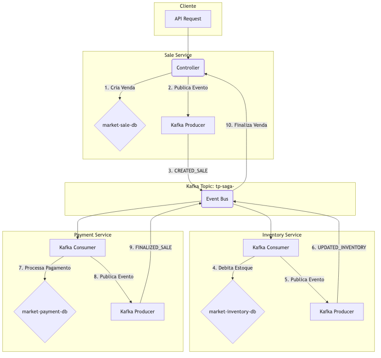
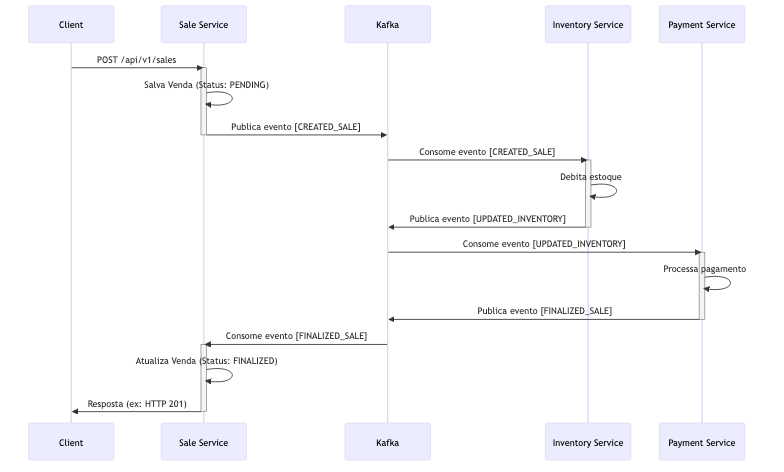
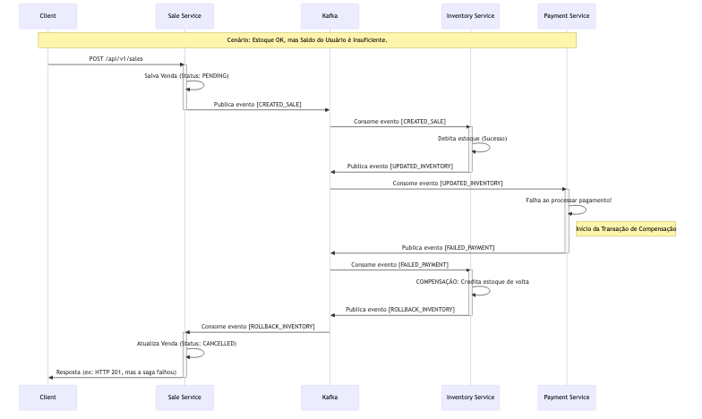

# Guia Prático: Implementando o Padrão Saga

## 1. Objetivo

O objetivo deste documento é fornecer um guia prático e didático para desenvolvedores que buscam compreender e implementar o padrão de projeto **Saga**. Através da análise de uma Prova de Conceito (POC) funcional, exploraremos os conceitos teóricos e os desafios práticos da manutenção da consistência de dados em uma arquitetura de microsserviços.

Ao final deste guia, você será capaz de:

- Entender os problemas que o padrão Saga se propõe a resolver.
- Diferenciar as abordagens de Coreografia e Orquestração.
- Analisar como os microsserviços podem se comunicar de forma assíncrona usando um message broker como o Apache Kafka.
- Implementar transações de negócio distribuídas e suas respectivas ações de compensação para lidar com falhas.

---

## 2. O Padrão de Projeto Saga

### 2.1. O que é e por que usar?

Em uma arquitetura de microsserviços, é comum que uma única transação de negócio precise atualizar dados em múltiplos serviços. Por exemplo, um pedido de e-commerce pode precisar:

1.  Reservar o item no serviço de **estoque**.
2.  Processar o pagamento no serviço de **pagamentos**.
3.  Criar o pedido no serviço de **vendas**.

O desafio aqui é: como garantir a consistência dos dados entre esses serviços? Não podemos simplesmente usar uma transação de banco de dados tradicional (ACID) que abranja múltiplos bancos de dados, pois isso violaria um dos princípios fundamentais dos microsserviços: o desacoplamento e a autonomia de cada serviço.

É para resolver este problema que surge o padrão **Saga**.

Uma Saga é uma sequência de transações locais onde cada transação atualiza o banco de dados de um único serviço e publica um evento ou mensagem para acionar a próxima etapa da transação. Se uma transação local falhar por qualquer motivo, a Saga executa uma série de **transações de compensação** para reverter ou anular as transações anteriores, garantindo assim que o sistema retorne a um estado consistente.

### 2.2. Tipos de Implementação

Existem duas maneiras principais de coordenar uma Saga:

#### Coreografia

Neste modelo, não há um coordenador central. Cada serviço participante da Saga publica eventos que são ouvidos pelos outros serviços. É uma abordagem descentralizada: um serviço finaliza sua transação e publica um evento, e o próximo serviço sabe que deve iniciar sua parte do trabalho ao receber este evento.

-   **Vantagens:**
    -   **Simplicidade:** Não há um ponto único de falha ou um serviço extra para gerenciar.
    -   **Desacoplamento:** Os serviços não precisam conhecer uns aos outros, apenas os eventos que eles emitem e consomem.
-   **Desvantagens:**
    -   **Rastreabilidade:** Pode ser difícil entender o fluxo de uma transação de negócio, pois a lógica está distribuída entre vários serviços.
    -   **Complexidade Cíclica:** Adicionar novos passos na Saga pode se tornar complexo, com risco de criar dependências cíclicas entre os serviços.

> **Nota:** A POC deste projeto utiliza a abordagem de Coreografia, sendo uma excelente forma de visualizar este padrão em ação.

#### Orquestração

Neste modelo, um serviço central, o **Orquestrador**, é responsável por dizer a cada participante o que fazer. O orquestrador gerencia toda a sequência de transações e as ações de compensação. Se algo falhar, é o orquestrador que comanda a reversão das operações.

-   **Vantagens:**
    -   **Visibilidade e Controle:** A lógica da transação está centralizada, tornando mais fácil entender, depurar e modificar o fluxo.
    -   **Gerenciamento Simplificado:** A lógica de compensação não é distribuída; ela fica a cargo do orquestrador.
-   **Desvantagens:**
    -   **Ponto Único de Falha:** O orquestrador é um componente crítico.
    -   **Maior Acoplamento:** Os serviços participantes são acoplados ao orquestrador.

### 2.3. Transações de Compensação

Uma transação de compensação é a "chave" para a resiliência do padrão Saga. Para cada passo da Saga que pode ser revertido, é necessário que exista uma ação correspondente que anule o seu efeito.

| Ação                  | Ação de Compensação        |
| --------------------- | -------------------------- |
| Debitar valor do user | Creditar valor para o user |
| Reservar estoque      | Liberar estoque            |
| Criar pedido          | Cancelar pedido            |

É crucial que as ações de compensação também sejam **idempotentes** e possam ser retentadas em caso de falha, garantindo que o sistema eventualmente alcance um estado consistente.

---

## 3. Analisando a POC: Saga com Coreografia em Ação

Agora que entendemos a teoria, vamos ver como ela se aplica na prática. A Prova de Conceito (POC) simula uma operação de venda simples, envolvendo três microsserviços que se comunicam de forma assíncrona via Apache Kafka para orquestrar a saga.

### 3.1. Visão Geral da Arquitetura

A arquitetura da solução é composta por três microsserviços principais, um message broker (Kafka) e bancos de dados dedicados para cada serviço, garantindo total autonomia e desacoplamento.



*   **Fluxo Principal (Caminho Feliz):** O diagrama acima ilustra o fluxo de eventos quando uma venda é bem-sucedida.
*   **Fluxo de Compensação:** Em caso de falha (ex: pagamento recusado ou falta de estoque), um evento de falha é publicado no mesmo tópico, desencadeando as ações de compensação nos serviços anteriores.

### 3.2. Os Microsserviços

Cada microsserviço na POC tem uma responsabilidade única e um banco de dados isolado.

-   **`sale-service`**:
    -   **Responsabilidade:** É a porta de entrada da transação. Responsável por criar a venda, gerenciar seu estado (`PENDENTE`, `FINALIZADA`, `CANCELADA`) e orquestrar o início e o fim da saga.
    -   **Banco de Dados:** Gerencia a entidade `Sale`.

-   **`payment-service`**:
    -   **Responsabilidade:** Ouve o evento de criação da venda e processa o pagamento. Ele verifica o saldo do usuário e, se for suficiente, debita o valor.
    -   **Banco de Dados:** Gerencia as entidades `User` e `Payment`.

-   **`inventory-service`**:
    -   **Responsabilidade:** Ouve o evento de pagamento bem-sucedido e debita o produto do estoque.
    -   **Banco de Dados:** Gerencia a entidade `Inventory`.

### 3.3. Comunicação com Apache Kafka

A comunicação entre os microsserviços é feita de forma assíncrona através do Apache Kafka. Vamos analisar as configurações em duas camadas: a infraestrutura do Kafka (definida no `compose.yml`) e a configuração do cliente Kafka em cada microsserviço (definida no `application.yaml`).

#### 3.3.1. Configuração do Serviço Kafka (`compose.yml`)

O serviço `kafka-service` no arquivo `compose.yml` é responsável por subir o broker Kafka. As variáveis de ambiente (`environment`) são cruciais para seu funcionamento:

```yaml
# compose.yml (trecho do kafka-service)
environment:
  # KRaft Mode: Roda o Kafka sem a dependência do ZooKeeper.
  KAFKA_NODE_ID: 1
  KAFKA_PROCESS_ROLES: broker,controller
  KAFKA_CONTROLLER_QUORUM_VOTERS: 1@kafka:9093

  # Listeners: Define como o Kafka "escuta" por conexões.
  KAFKA_LISTENERS: CONTROLLER://kafka:9093,INTERNAL://0.0.0.0:29092,EXTERNAL://0.0.0.0:9092
  KAFKA_ADVERTISED_LISTENERS: INTERNAL://kafka:29092,EXTERNAL://localhost:9092
  KAFKA_LISTENER_SECURITY_PROTOCOL_MAP: CONTROLLER:PLAINTEXT,INTERNAL:PLAINTEXT,EXTERNAL:PLAINTEXT
  KAFKA_INTER_BROKER_LISTENER_NAME: INTERNAL

  # Single Node Replication Settings
  KAFKA_OFFSETS_TOPIC_REPLICATION_FACTOR: 1
  KAFKA_TRANSACTION_STATE_LOG_REPLICATION_FACTOR: 1
  KAFKA_TRANSACTION_STATE_LOG_MIN_ISR: 1

  # Development Settings
  KAFKA_AUTO_CREATE_TOPICS_ENABLE: 'true'
```

-   **`KAFKA_PROCESS_ROLES`**: Define que este nó atuará tanto como `broker` (armazenando dados) quanto como `controller` (gerenciando o cluster). Essencial para o modo KRaft em um único nó.
-   **`KAFKA_LISTENERS`**: Configura os sockets de rede que o Kafka abrirá.
    -   `INTERNAL://0.0.0.0:29092`: Um listener para a comunicação **dentro** da rede Docker. Os outros contêineres (microsserviços) se conectarão ao Kafka através desta porta.
    -   `EXTERNAL://0.0.0.0:9092`: Um listener para a comunicação **fora** da rede Docker. É por isso que podemos nos conectar à porta `9092` da nossa máquina host.
-   **`KAFKA_ADVERTISED_LISTENERS`**: Informa aos clientes como eles devem se conectar ao Kafka.
    -   `INTERNAL://kafka:29092`: Diz aos clientes *dentro* do Docker para usarem o hostname `kafka` e a porta `29092`.
    -   `EXTERNAL://localhost:9092`: Diz aos clientes *fora* do Docker (como uma aplicação na sua máquina) para usarem `localhost` e a porta `9092`.
-   **`KAFKA_INTER_BROKER_LISTENER_NAME`**: Especifica que a comunicação entre os brokers (neste caso, apenas um) deve usar o listener `INTERNAL`.
-   **`KAFKA_OFFSETS_TOPIC_REPLICATION_FACTOR: 1`**: Define o fator de replicação para o tópico interno do Kafka que armazena os offsets dos consumidores. Como temos apenas um broker, o valor deve ser `1`. Em um cluster com múltiplos brokers, um valor maior (ex: `3`) garantiria a durabilidade desses dados mesmo que um broker falhe.
-   **`KAFKA_AUTO_CREATE_TOPICS_ENABLE: 'true'`**: Uma configuração muito útil para desenvolvimento. Permite que os tópicos sejam criados automaticamente quando um produtor tenta enviar uma mensagem para um tópico que ainda não existe. Em produção, isso geralmente é definido como `false` para um controle mais rigoroso.

#### 3.3.2. Configuração do Cliente Kafka (`application.yaml`)

Agora, vamos analisar como os microsserviços (clientes Kafka) são configurados. Além das propriedades customizadas em `application-config`, o Spring Boot gerencia outras configurações importantes.

**Exemplo (`sale-service/src/main/resources/application.yaml` e configurações do Spring):**
```yaml
# application.yaml
application-config:
  kafka:
    server-url: ${SPRING_KAFKA_BOOTSTRAP_SERVERS:localhost:9092}
    auto-offset-reset: "earliest"
    topic: ${KAFKA_TOPIC:tp-saga-market}
    producer:
      group-id: "send-sale" # Usado para identificação/logging
    consumer:
      group-id:
        finalize: "finalize-sale"
        cancel: "cancel-sale"
```

-   **`server-url`**: Aponta para o broker Kafka. Note que no `compose.yml`, o `SPRING_KAFKA_BOOTSTRAP_SERVERS` para os serviços é `kafka:29092`, usando o listener interno do Docker. O valor `localhost:9092` é apenas um fallback para execução local fora do Docker.
-   **`auto-offset-reset: "earliest"`**: Esta é uma configuração de consumidor extremamente importante. Ela dita o que fazer quando um consumidor se conecta pela primeira vez (ou após um longo tempo offline) e não há um *offset* (ponteiro da última mensagem lida) salvo para ele.
    -   **`earliest` (usado na POC):** O consumidor começará a ler desde o **início** do tópico. Isso é ótimo para garantir que nenhuma mensagem seja perdida, mesmo que o consumidor estivesse offline quando a mensagem foi enviada.
    -   **`latest` (padrão):** O consumidor começará a ler apenas as **novas** mensagens que chegarem após sua conexão. Mensagens enviadas enquanto ele estava offline seriam ignoradas.
-   **`consumer.group-id`**: Identifica um grupo de consumidores.
    -   **`finalize: "finalize-sale"`** e **`cancel: "cancel-sale"`**: O `sale-service` tem dois consumidores distintos, cada um com seu próprio `group-id`. Isso significa que ambos receberão **todas as mensagens** do tópico `tp-saga-market`. Cada consumidor então filtra internamente a mensagem que lhe interessa (seja para finalizar ou para cancelar a venda). Essa é uma estratégia para permitir que um único serviço reaja a múltiplos eventos diferentes dentro da mesma saga.
-   **Serializadores e Desserializadores (`(De)Serializer`)**: Embora não estejam explícitos no `application.yaml` da POC (estão configurados via classes de configuração do Spring), eles são fundamentais e serão detalhados na próxima seção.

#### 3.3.3. Serializadores e Desserializadores Customizados

Para que os objetos Java (POJOs) possam ser trafegados pelo Kafka, eles precisam ser convertidos em bytes (serializados) e depois reconvertidos de bytes para objetos (desserializados). A POC utiliza implementações customizadas para lidar com a conversão para o formato JSON, o que oferece legibilidade e flexibilidade.

-   **`CustomSerializer`**: Esta classe é responsável por converter o objeto de mensagem (ex: `SaleMessageDTO`) em um array de bytes.
    -   **Como funciona:** Ela utiliza a biblioteca **Jackson (`ObjectMapper`)** para transformar o objeto Java em uma string JSON. Em seguida, essa string é convertida para bytes no padrão `UTF-8`.
    -   **Configuração importante:** `SerializationFeature.WRITE_DATES_AS_TIMESTAMPS` é desabilitado para garantir que datas sejam serializadas em um formato de string legível (como `2023-10-27T10:00:00Z`) em vez de um número (timestamp).

-   **`CustomDeserializer`**: Faz o trabalho inverso no lado do consumidor.
    -   **Como funciona:** Recebe um array de bytes do Kafka, converte-o para uma string `UTF-8` e, em seguida, usa o `ObjectMapper` para "mapear" a string JSON de volta para uma instância do objeto Java correspondente (ex: `SaleMessageDTO`).
    -   **Tratamento de Nulos:** A implementação verifica se os dados recebidos são nulos ou vazios, retornando `null` para evitar erros de desserialização em mensagens vazias.
    -   **Módulo de Tempo:** Ambos registram o `JavaTimeModule`, que é essencial para que o Jackson consiga serializar e desserializar corretamente os tipos de data e hora do Java 8+ (como `LocalDateTime`).

Essa abordagem de serialização para JSON é muito comum em sistemas distribuídos, pois facilita a depuração (as mensagens no Kafka são legíveis por humanos) e a interoperabilidade entre serviços que podem ser escritos em diferentes linguagens.

#### 3.3.4. Configuração Programática do Producer e Consumer (Spring Kafka)

Além das configurações no `application.yaml`, a integração entre o Spring Boot e o Kafka é refinada através de classes de configuração Java. Elas criam os "beans" necessários para que a aplicação possa produzir e consumir mensagens de forma eficiente.

-   **`KafkaSaleProducerConfig.java`**: Configura como a aplicação enviará mensagens.
    -   **`ProducerFactory`**: É o coração da configuração do produtor. Ele define as propriedades essenciais para se conectar e enviar mensagens ao Kafka.
        -   `BOOTSTRAP_SERVERS_CONFIG`: Endereço do broker Kafka, injetado a partir do `application.yaml`.
        -   `KEY_SERIALIZER_CLASS_CONFIG`: Define o serializador para a *chave* da mensagem. A POC usa `StringSerializer`, significando que a chave é uma simples string.
        -   `VALUE_SERIALIZER_CLASS_CONFIG`: Define o serializador para o *valor* (o corpo) da mensagem. Aqui é onde o `CustomSerializer.class` (discutido anteriormente) é conectado, garantindo que o objeto `SaleMessageDTO` seja convertido para JSON.
    -   **`KafkaTemplate`**: É um "helper" do Spring que simplifica o envio de mensagens. Ele encapsula a lógica do produtor e oferece métodos convenientes como `send(topic, message)`. O `KafkaTemplate` é injetado nos serviços que precisam publicar eventos.

-   **`KafkaSaleConsumerConfig.java`**: Configura como a aplicação receberá mensagens.
    -   **`@EnableKafka`**: Esta anotação é crucial. Ela habilita a detecção de anotações `@KafkaListener` no projeto, que é a forma como o Spring cria consumidores para os tópicos.
    -   **`ConsumerFactory`**: Similar ao `ProducerFactory`, define as propriedades para a conexão do consumidor.
        -   `KEY_DESERIALIZER_CLASS_CONFIG`: O inverso do serializador, `StringDeserializer` para a chave.
        -   `VALUE_DESERIALIZER_CLASS_CONFIG`: O ponto de conexão para o `CustomDeserializer.class`, que transformará o JSON recebido de volta em um objeto `SaleMessageDTO`.
        -   `AUTO_OFFSET_RESET_CONFIG`: Configura o comportamento inicial do consumidor (`earliest` ou `latest`), também injetado do `application.yaml`.
    -   **`ConcurrentKafkaListenerContainerFactory`**: Cria os contêineres que gerenciam os listeners. Ele utiliza o `ConsumerFactory` para configurar os consumidores que ficarão "ouvindo" as mensagens nos tópicos do Kafka de forma concorrente e gerenciada pelo Spring.

Essas classes de configuração fornecem um controle refinado e programático sobre a comunicação com o Kafka, permitindo a integração de lógicas customizadas (como os (de)serializadores) e aproveitando o poder do ecossistema Spring para gerenciar o ciclo de vida dos produtores e consumidores.

---

## 4. Fluxo da Saga: Passo a Passo de uma Venda

Antes de detalhar cada passo, vamos visualizar os dois principais fluxos com diagramas de sequência.

#### Diagrama: Caminho Feliz

Este diagrama mostra a sequência de interações quando a venda ocorre sem nenhum problema.



#### Diagrama: Falha no Pagamento e Compensação

Este diagrama ilustra o fluxo de compensação quando o estoque é reservado com sucesso, mas o pagamento falha.



Nesta seção, vamos detalhar a sequência de eventos e ações, tanto no cenário ideal (caminho feliz) quanto nos cenários onde ocorrem falhas, acionando as transações de compensação. A análise a seguir é baseada diretamente no código-fonte da POC.

### 4.1. Caminho Feliz (Happy Path)

O caminho feliz descreve o fluxo completo de uma venda bem-sucedida.

**Passo 1: Cliente inicia a venda**
-   Uma requisição `POST` é enviada para o endpoint `/api/v1/sales` no `sale-service`.

**Passo 2: `sale-service` cria a venda**
-   O `CreateSaleUseCase` é acionado.
-   Uma nova venda é salva no banco de dados com o status `PENDING`.
-   Um evento `CREATED_SALE` é publicado no tópico `saga-sale`.

**Passo 3: `inventory-service` separa a mercadoria**
-   O `ReceiveSaleToDebitInventoryConsumer` consome o evento `CREATED_SALE`.
-   O `DebitInventoryUseCase` é acionado para debitar o estoque.
-   Se bem-sucedido, um evento `UPDATED_INVENTORY` é publicado no tópico `saga-sale`.

**Passo 4: `payment-service` processa o pagamento**
-   O `ReceiveSaleToPaymentConsumer` consome o evento `UPDATED_INVENTORY`.
-   O `SalePaymentUseCase` é acionado para debitar o valor do usuário.
-   Se bem-sucedido, um evento `FINALIZED_SALE` é publicado no tópico `saga-sale`.

**Passo 5: `sale-service` finaliza a venda**
-   O `ReceiveSaleToFinalizeConsumer` consome o evento `FINALIZED_SALE`.
-   O `FinalizeSaleUseCase` atualiza o status da venda para `FINALIZED`.
-   A Saga é concluída com sucesso.

### 4.2. Simulando Falhas e Ações de Compensação

#### Cenário 1: Falha no Estoque (Produto Indisponível)

Este é o primeiro ponto de falha possível na saga.

**Como Simular:**
-   Zere a quantidade de um produto no banco de dados do `inventory-service` e tente comprar esse produto.

**Fluxo de Compensação:**
1.  **`inventory-service` detecta a falha:** O `DebitInventoryUseCase` percebe que o estoque é insuficiente.
2.  **Publica evento de falha:** Ele publica um evento `ROLLBACK_INVENTORY`.
3.  **`sale-service` cancela a venda:**
    -   O `CancelSaleConsumer` consome o evento `ROLLBACK_INVENTORY`.
    -   O `CancelSaleUseCase` atualiza o status da venda para `CANCELLED`.
    -   A Saga é encerrada de forma consistente.

#### Cenário 2: Falha no Pagamento (Saldo Insuficiente)

Neste cenário, o estoque foi debitado, mas o pagamento falhou. A ação de compensação deve reverter o débito do estoque.

**Como Simular:**
-   Garanta que o produto tenha estoque, mas utilize um `userId` sem saldo suficiente no banco de dados do `payment-service`.

**Fluxo de Compensação:**
1.  **`payment-service` detecta a falha:** O `SalePaymentUseCase` percebe que o saldo é insuficiente.
2.  **Publica evento de falha:** Ele publica um evento `FAILED_PAYMENT`.
3.  **`inventory-service` compensa o estoque:**
    -   O `ReceiveSaleToCreditInventoryConsumer` consome o evento `FAILED_PAYMENT`.
    -   O `CreditInventoryInputPort` é acionado, creditando (devolvendo) o item ao estoque.
    -   Após a compensação, ele publica o evento `ROLLBACK_INVENTORY`.
4.  **`sale-service` cancela a venda:**
    -   O `CancelSaleConsumer` consome o `ROLLBACK_INVENTORY` (publicado pelo `inventory-service` no passo anterior) e atualiza o status da venda para `CANCELLED`.

Este cenário demonstra uma compensação em múltiplos estágios, garantindo que o sistema retorne a um estado consistente.

---
