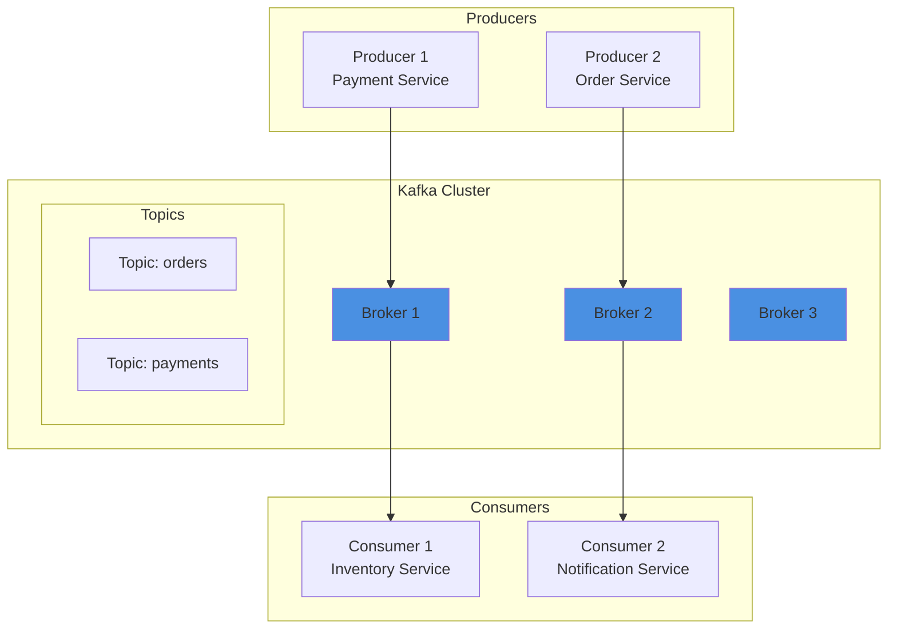
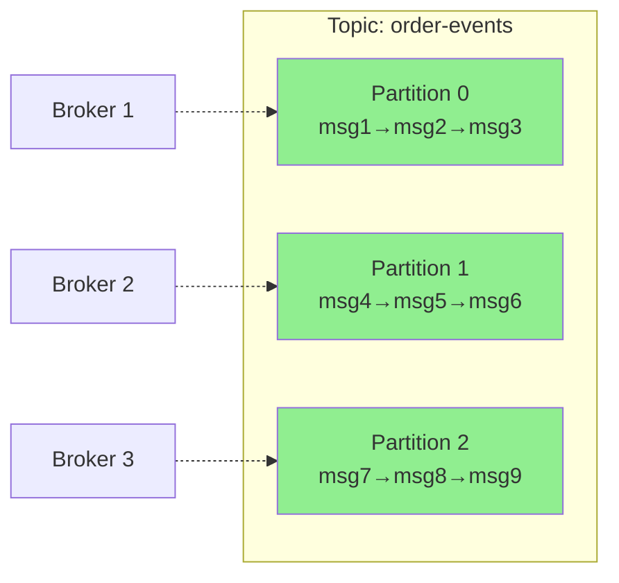
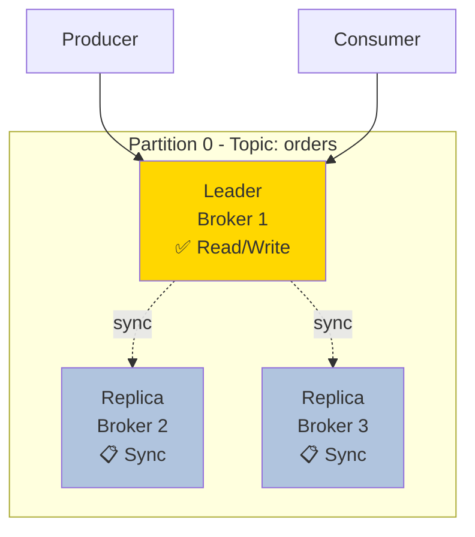
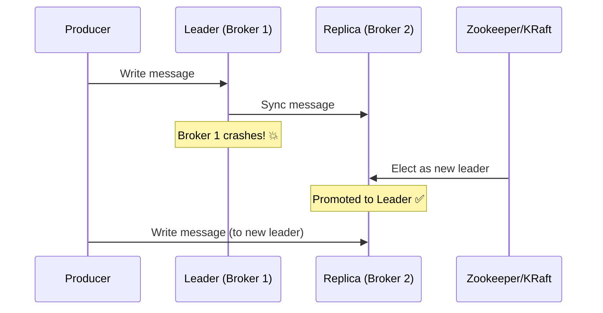
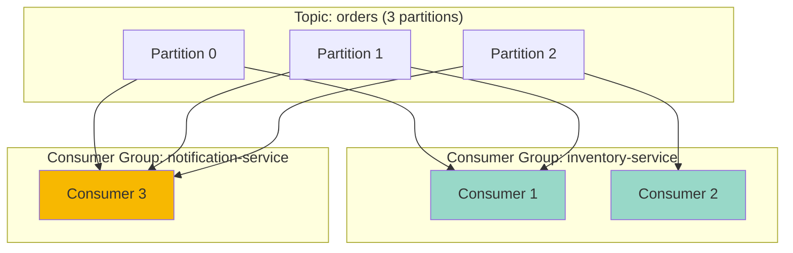
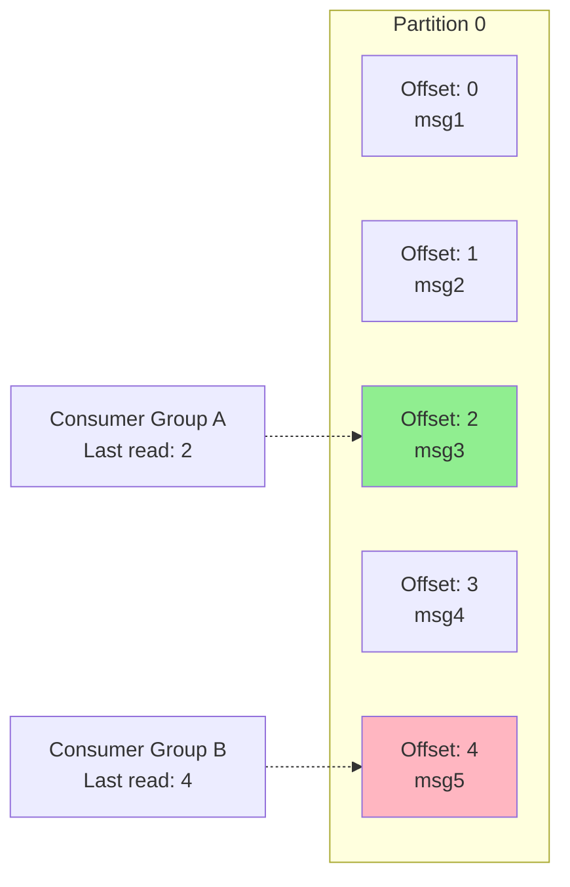
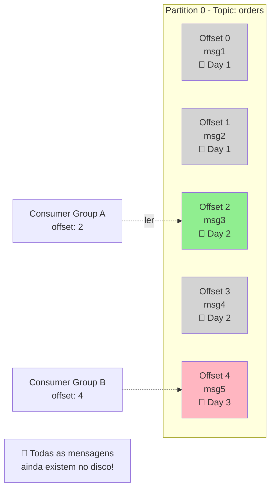
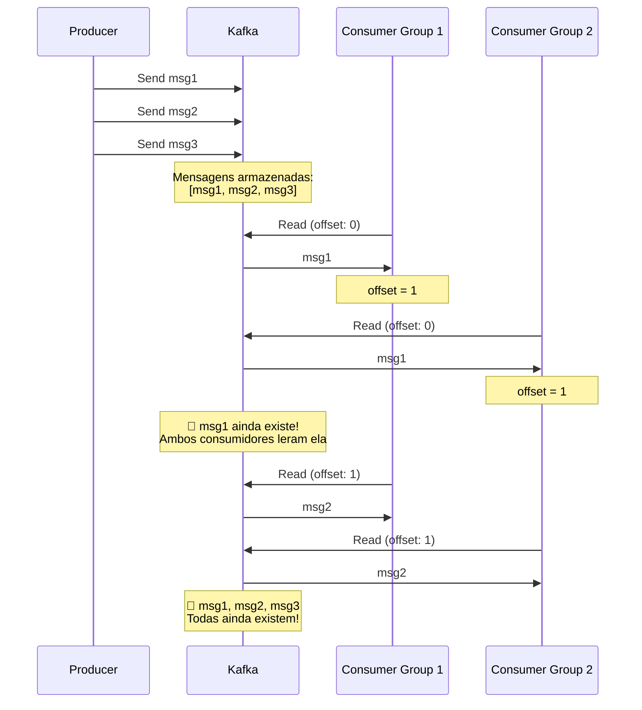
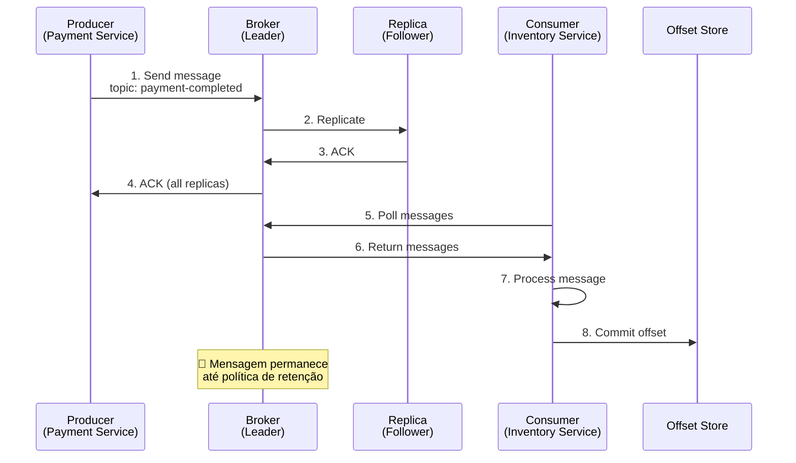
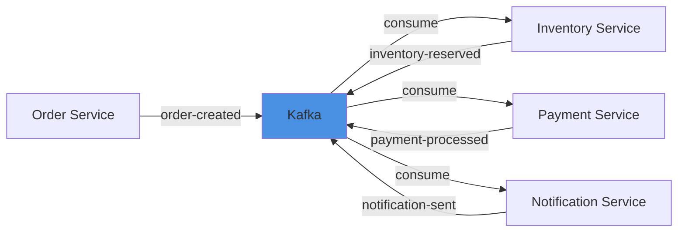

# Kafka - Conceitos Básicos

## O que é Apache Kafka?

Apache Kafka é uma **plataforma de streaming de eventos distribuída** que permite:
- Publicar e assinar streams de eventos (mensagens)
- Armazenar streams de forma durável e confiável
- Processar streams em tempo real

Pense no Kafka como um **"sistema nervoso"** que conecta diferentes partes de uma aplicação distribuída através de eventos.

## Arquitetura Geral



---

## 1. Broker

### O que é?
Um **Broker** é um servidor Kafka. É o "trabalhador" que armazena e serve as mensagens.

### Características:
- Um cluster Kafka geralmente tem **múltiplos brokers** para redundância
- Cada broker é identificado por um **ID único**
- Brokers gerenciam as partições e replicação dos dados

### Exemplo Prático:
```yaml
# No seu docker-compose.yml
kafka-service:
  image: confluentinc/cp-server:7.0.1
  environment:
    KAFKA_BROKER_ID: 1  # ID único deste broker
```

### Analogia:
Pense em um broker como um **servidor de banco de dados** em um cluster distribuído.

---

## 2. Topic (Tópico)

### O que é?
Um **Topic** é uma categoria ou canal onde os eventos são publicados. É como uma "fila nomeada" ou "tabela de eventos".

### Características:
- Identificado por um **nome único**
- Pode ter **múltiplas partições** para paralelismo
- Mensagens são armazenadas por um período configurável

### Exemplo Prático:
```java
// Criando um tópico
String topicName = "order-events";

// Publicando no tópico
producer.send(new ProducerRecord<>("order-events", key, value));

// Consumindo do tópico
consumer.subscribe(Arrays.asList("order-events"));
```

### Tópicos comuns em um sistema de vendas:
- `order-created` - Quando um pedido é criado
- `payment-completed` - Quando um pagamento é processado
- `inventory-reserved` - Quando o estoque é reservado

### Analogia:
Um topic é como um **feed de notícias** ou **canal do Slack** - todos que se inscrevem recebem as mensagens.

---

## 3. Partition (Partição)

### O que é?
Uma **Partition** é uma subdivisão de um topic. Permite paralelismo e escalabilidade.

### Características:
- Cada partição é uma **sequência ordenada** de mensagens
- Partições são distribuídas entre os brokers
- Mensagens dentro de uma partição mantêm a **ordem**

### Diagrama de Partições:



### Exemplo Prático:
```java
// Producer decide a partição baseado na chave
ProducerRecord<String, String> record =
    new ProducerRecord<>(
        "order-events",    // topic
        customerId,        // key - determina a partição
        orderData          // value
    );

// Mensagens com a mesma key vão para a mesma partição
// garantindo ordem por cliente
```

### Por que usar partições?
1. **Paralelismo**: Múltiplos consumidores podem ler partições diferentes simultaneamente
2. **Escalabilidade**: Distribui carga entre brokers
3. **Ordem garantida**: Dentro de cada partição (não entre partições)

---

## 4. Leader e Replica

### O que é?
Para cada partição, um broker é o **Leader** e outros são **Replicas** (seguidores).

### Características:
- **Leader**: Responsável por todas as leituras e escritas da partição
- **Replicas**: Cópias de backup que sincronizam com o leader
- Se o leader falhar, uma replica é **promovida a leader**

### Diagrama de Replicação:



### Configuração no docker-compose.yml:
```yaml
KAFKA_TRANSACTION_STATE_LOG_REPLICATION_FACTOR: 1
KAFKA_OFFSETS_TOPIC_REPLICATION_FACTOR: 1
```
*Nota: Fator de replicação 1 significa sem réplicas (apenas para desenvolvimento)*

### Exemplo de Falha e Recuperação:



---

## 5. Producer (Produtor)

### O que é?
Uma aplicação que **publica** (envia) mensagens para um topic.

### Características:
- Decide qual partição usar (baseado na key ou round-robin)
- Pode ter confirmação de entrega (acks)
- Buffer interno para batch de mensagens

### Exemplo Prático:
```java
@Service
public class OrderEventProducer {

    @Autowired
    private KafkaTemplate<String, OrderEvent> kafkaTemplate;

    public void publishOrderCreated(OrderEvent event) {
        // Envia evento para o topic
        kafkaTemplate.send("order-events", event.getOrderId(), event);
    }
}
```

### Configurações importantes:
```properties
# Confirmação de escrita
acks=all  # Aguarda todas as replicas confirmarem

# Retry
retries=3

# Compressão
compression.type=snappy
```

---

## 6. Consumer (Consumidor)

### O que é?
Uma aplicação que **lê** mensagens de um ou mais topics.

### Características:
- Faz parte de um **Consumer Group**
- Mantém track do **offset** (posição da última mensagem lida)
- Pode processar mensagens em paralelo

### Exemplo Prático:
```java
@Service
public class OrderEventConsumer {

    @KafkaListener(
        topics = "order-events",
        groupId = "inventory-service"
    )
    public void consumeOrderEvent(OrderEvent event) {
        // Processa o evento
        inventoryService.reserveItems(event.getItems());
    }
}
```

---

## 7. Consumer Group

### O que é?
Um **Consumer Group** é um conjunto de consumidores que trabalham juntos para consumir um topic.

### Características:
- Cada partição é consumida por **apenas um consumidor** do group
- Permite escalabilidade horizontal
- Diferentes groups podem consumir o mesmo topic independentemente

### Diagrama de Consumer Groups:



### Exemplo de Escalabilidade:
```
Topic com 3 partições:

1 Consumer no group:
  Consumer 1 → P0, P1, P2 (lê todas)

2 Consumers no group:
  Consumer 1 → P0, P1
  Consumer 2 → P2

3 Consumers no group:
  Consumer 1 → P0
  Consumer 2 → P1
  Consumer 3 → P2

4 Consumers no group:
  Consumer 1 → P0
  Consumer 2 → P1
  Consumer 3 → P2
  Consumer 4 → (idle) ⚠️ Mais consumers que partições!
```

---

## 8. Offset

### O que é?
O **Offset** é um número sequencial único que identifica cada mensagem dentro de uma partição.

### Características:
- Começa em 0 e incrementa sequencialmente
- Cada consumer group mantém seu próprio offset
- Permite reprocessamento de mensagens

### Diagrama de Offsets:



### Exemplo Prático:
```java
// Commit manual do offset
@KafkaListener(topics = "orders")
public void consume(ConsumerRecord<String, Order> record) {
    processOrder(record.value());

    // Só commita o offset se processou com sucesso
    acknowledgment.acknowledge();
}
```

### Estratégias de Commit:
- **Auto-commit**: Kafka commita automaticamente (pode perder mensagens)
- **Manual-commit**: Aplicação controla quando committar (mais seguro)

---

## 9. Mensagens são Apagadas ao Serem Consumidas?

### Resposta Curta: NÃO!

**Diferente de filas tradicionais**, quando um consumer lê uma mensagem no Kafka, ela **NÃO é apagada**. Apenas o **offset é movido**.

### Como Funciona:



### Kafka vs Fila Tradicional

#### Fila Tradicional (RabbitMQ, SQS):
```
Producer → [msg1, msg2, msg3] → Consumer
                                    ↓
                     [msg2, msg3]  (msg1 apagada!)
```

#### Kafka (Log Distribuído):
```
Producer → [msg1, msg2, msg3, msg4, msg5...] → Consumer 1 (offset: 2)
                                              → Consumer 2 (offset: 4)
                                              → Consumer 3 (offset: 1)

💾 Todas as mensagens continuam no disco!
```

### Quando as Mensagens SÃO Apagadas?

Mensagens são apagadas **automaticamente** por política de retenção, **independente de terem sido consumidas ou não**:

#### 1. Retenção por Tempo (padrão: 7 dias)
```properties
# Configuração do topic
retention.ms=604800000  # 7 dias em milissegundos

# Depois de 7 dias, a mensagem é deletada automaticamente
```

#### 2. Retenção por Tamanho
```properties
retention.bytes=1073741824  # 1 GB

# Quando o topic atingir 1GB, mensagens antigas são deletadas
```

#### 3. Configuração no docker-compose.yml:
```yaml
kafka-service:
  environment:
    KAFKA_LOG_RETENTION_HOURS: 168  # 7 dias
    KAFKA_LOG_RETENTION_BYTES: -1   # Ilimitado (-1)
```

### Vantagens dessa Abordagem

#### 1. Múltiplos Consumidores Independentes
```java
// Consumer Group 1: Inventory Service
@KafkaListener(topics = "order-created", groupId = "inventory-service")
public void consumeInventory(OrderEvent event) {
    inventoryService.reserve(event);
}

// Consumer Group 2: Notification Service
@KafkaListener(topics = "order-created", groupId = "notification-service")
public void consumeNotification(OrderEvent event) {
    notificationService.send(event);
}

// Ambos leem as MESMAS mensagens!
// Cada group mantém seu próprio offset
```

#### 2. Replay de Mensagens (Reprocessamento)
```java
// Você pode "voltar no tempo" e reprocessar mensagens antigas!
consumer.seek(partition, 0);  // Volta para o offset 0

// Útil para:
// - Corrigir bugs reprocessando eventos
// - Reconstruir cache ou índices
// - Análise retrospectiva de dados
```

#### 3. Event Sourcing
```java
// Reconstruir o estado completo lendo todos os eventos desde o início
public Order rebuildOrderState(String orderId) {
    consumer.seek(partition, 0);  // Início
    List<OrderEvent> allEvents = consumer.poll();

    return allEvents.stream()
        .filter(e -> e.getOrderId().equals(orderId))
        .reduce(new Order(), (order, event) -> order.apply(event));
}
```

### Diagrama: Múltiplos Consumers Lendo as Mesmas Mensagens



### Comparação: Kafka vs Fila Tradicional

| Aspecto | Kafka | Fila Tradicional (RabbitMQ, SQS) |
|---------|-------|----------------------------------|
| **Mensagem após consumo** | ✅ Permanece até expirar | ❌ Apagada imediatamente |
| **Múltiplos consumers** | ✅ Sim (via consumer groups) | ⚠️ Limitado (fanout exchange) |
| **Replay/Reprocessamento** | ✅ Sim, volte no tempo | ❌ Não é possível |
| **Quando apaga** | ⏰ Após política de retenção | 🔄 Após ACK do consumer |
| **Offset/Posição** | ✅ Por consumer group | ❌ Não aplicável |
| **Event Sourcing** | ✅ Ideal | ⚠️ Não recomendado |
| **Ordenação** | ✅ Por partição | ⚠️ Limitada |
| **Throughput** | ✅ Milhões/seg | ⚠️ Milhares/seg |

### Exemplo Prático: Reprocessamento após Bug Fix

```java
// Cenário: Bug no cálculo de desconto foi corrigido
// Queremos reprocessar pedidos dos últimos 3 dias

@Service
public class OrderReprocessingService {

    public void reprocessOrders() {
        // 1. Cria um consumer temporário
        KafkaConsumer<String, OrderEvent> consumer = createConsumer();

        // 2. Calcula offset de 3 dias atrás
        long threeDaysAgo = System.currentTimeMillis() - (3 * 24 * 60 * 60 * 1000);
        Map<TopicPartition, Long> timestamps = consumer.offsetsForTimes(
            Collections.singletonMap(
                new TopicPartition("order-created", 0),
                threeDaysAgo
            )
        );

        // 3. Reposiciona o offset
        timestamps.forEach((partition, offsetAndTimestamp) -> {
            consumer.seek(partition, offsetAndTimestamp);
        });

        // 4. Reprocessa mensagens
        while (true) {
            ConsumerRecords<String, OrderEvent> records = consumer.poll(Duration.ofSeconds(1));
            for (ConsumerRecord<String, OrderEvent> record : records) {
                // Aplica novo cálculo de desconto
                recalculateDiscount(record.value());
            }
        }
    }
}
```

### Resumo

**Kafka funciona como um log append-only (somente adição) que mantém histórico!**

- Mensagens **NÃO são apagadas** quando consumidas
- Cada consumer group rastreia seu próprio **offset**
- Mensagens expiram baseado em **tempo** ou **tamanho**, não em consumo
- Permite **múltiplos consumidores** independentes
- Possibilita **replay** e **event sourcing**
- Ideal para arquiteturas orientadas a eventos e microservices

---

## Fluxo Completo de uma Mensagem



---

## Exemplo Prático: Sistema de Pedidos

### Cenário:
Um cliente faz um pedido que precisa:
1. Reservar estoque
2. Processar pagamento
3. Enviar notificação

### Fluxo com Kafka:



### Código do Producer:
```java
// Order Service
@Service
public class OrderService {

    public void createOrder(Order order) {
        // 1. Salva no banco
        orderRepository.save(order);

        // 2. Publica evento
        OrderCreatedEvent event = new OrderCreatedEvent(
            order.getId(),
            order.getCustomerId(),
            order.getItems()
        );

        kafkaTemplate.send("order-created", order.getId(), event);
    }
}
```

### Código do Consumer:
```java
// Inventory Service
@Service
public class InventoryEventConsumer {

    @KafkaListener(
        topics = "order-created",
        groupId = "inventory-service"
    )
    public void handleOrderCreated(OrderCreatedEvent event) {
        // Reserva itens do estoque
        inventoryService.reserve(event.getItems());

        // Publica evento de confirmação
        kafkaTemplate.send("inventory-reserved", event.getOrderId(), ...);
    }
}
```

---

## Configuração no seu docker-compose.yml

```yaml
kafka-service:
  image: confluentinc/cp-server:7.0.1
  environment:
    # ID único deste broker
    KAFKA_BROKER_ID: 1

    # Listeners (portas de comunicação)
    KAFKA_ADVERTISED_LISTENERS: INTERNAL://kafka:29092,EXTERNAL://localhost:9092

    # Replicação (1 = sem réplicas, apenas dev)
    KAFKA_OFFSETS_TOPIC_REPLICATION_FACTOR: 1
    KAFKA_TRANSACTION_STATE_LOG_REPLICATION_FACTOR: 1
```

---

## Principais Vantagens do Kafka

1. **Alta Performance**: Milhões de mensagens por segundo
2. **Durabilidade**: Mensagens persistidas em disco
3. **Escalabilidade**: Adicione brokers e partições conforme necessário
4. **Tolerância a Falhas**: Replicação automática
5. **Desacoplamento**: Produtores e consumidores independentes
6. **Replay**: Possibilidade de reprocessar mensagens antigas

---

## Quando Usar Kafka?

### ✅ Ideal para:
- Event sourcing e CQRS
- Saga pattern (como no seu projeto!)
- Streaming de dados em tempo real
- Log aggregation
- Microservices communication
- Activity tracking

### ⚠️ Não ideal para:
- Request/response síncrono (use REST/gRPC)
- Mensagens que expiram rapidamente
- Poucos eventos (overhead desnecessário)
- Processamento transacional direto

---

## Glossário Rápido

| Termo | Definição |
|-------|-----------|
| **Broker** | Servidor Kafka que armazena mensagens |
| **Topic** | Canal/categoria de mensagens |
| **Partition** | Subdivisão de um topic para paralelismo |
| **Leader** | Broker responsável por uma partição |
| **Replica** | Cópia de backup de uma partição |
| **Producer** | Aplicação que publica mensagens |
| **Consumer** | Aplicação que lê mensagens |
| **Consumer Group** | Grupo de consumidores trabalhando juntos |
| **Offset** | Posição sequencial de uma mensagem |
| **Zookeeper** | Serviço de coordenação (versões antigas) |
| **KRaft** | Modo sem Zookeeper (versões novas) |

---

## Próximos Passos

1. Explore o Kafka UI disponível em: http://localhost:8181
2. Veja os tópicos criados pelo seu sistema
3. Monitore mensagens em tempo real
4. Experimente criar tópicos manualmente

## Referências

- [Apache Kafka Documentation](https://kafka.apache.org/documentation/)
- [Confluent Documentation](https://docs.confluent.io/)
- [Kafka: The Definitive Guide](https://www.confluent.io/resources/kafka-the-definitive-guide/)
