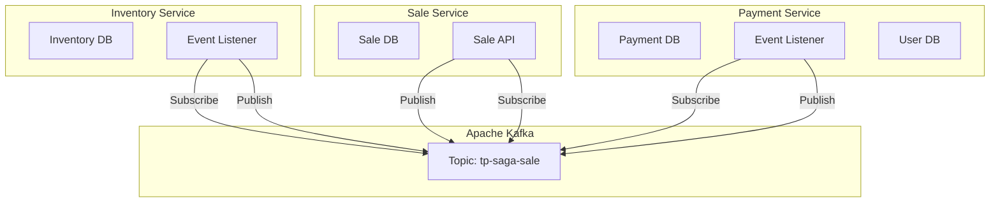
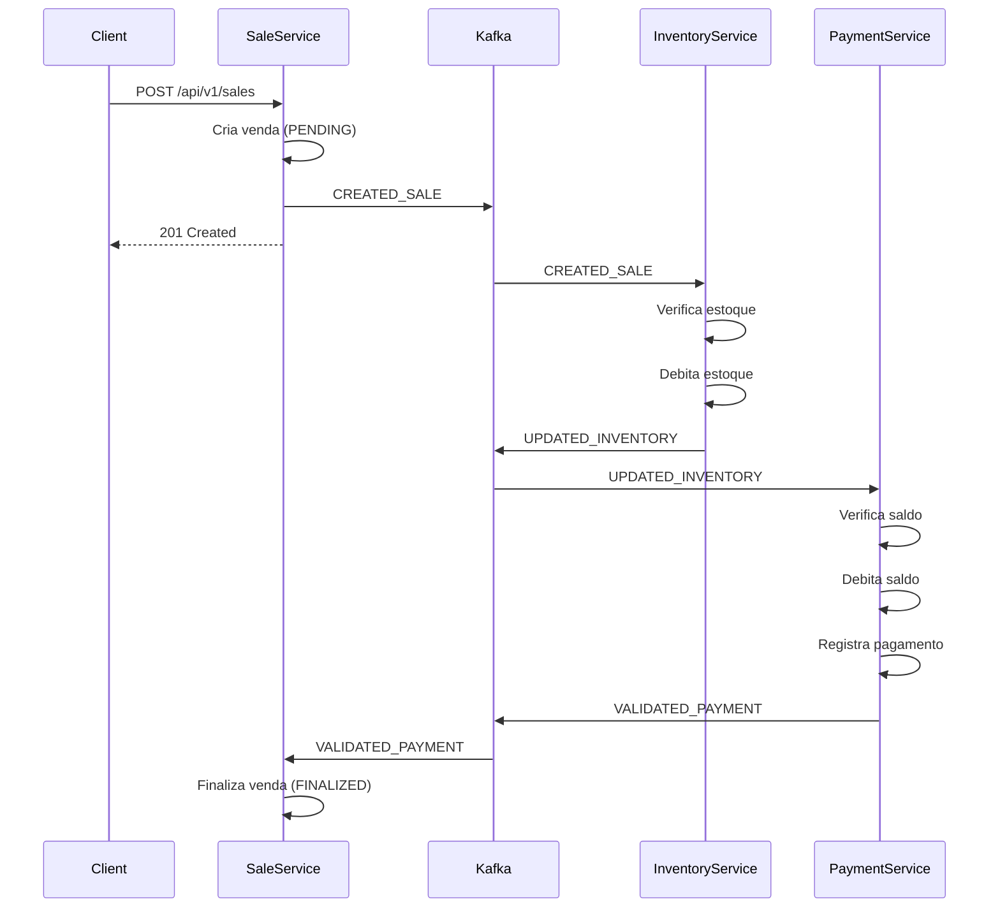
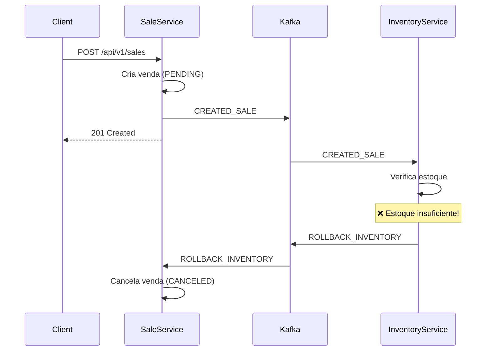
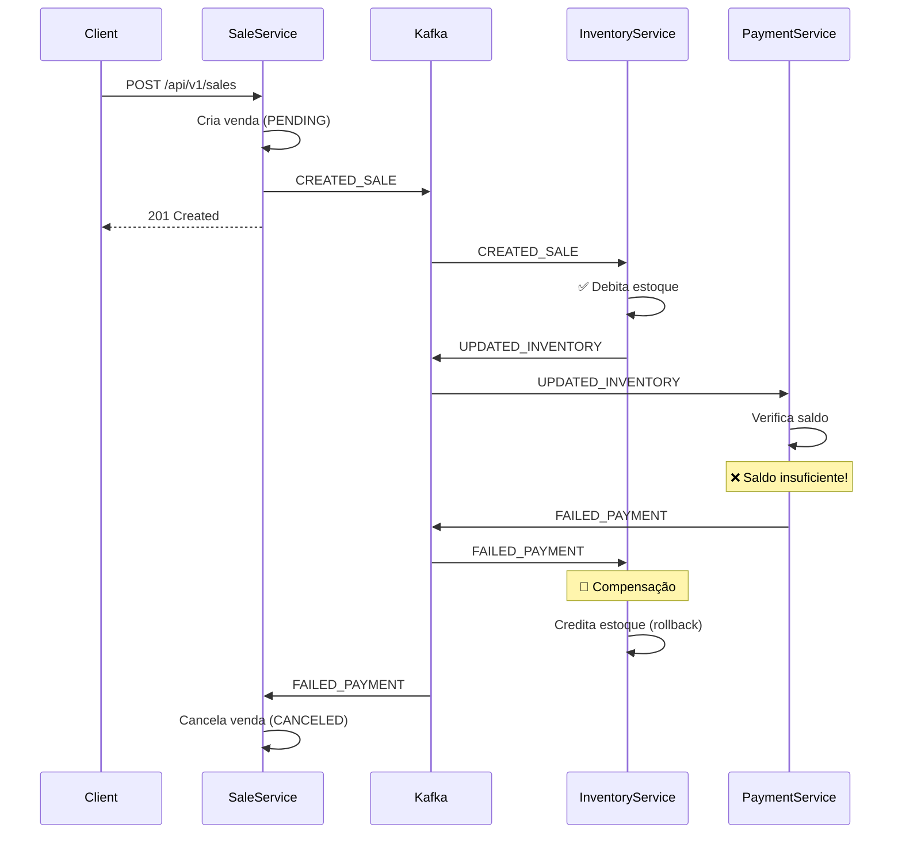

# Saga Pattern - Tutorial Completo para Aula

## Índice
1. [Visão Geral](#visão-geral)
2. [Conceitos Fundamentais](#conceitos-fundamentais)
3. [Arquitetura do Sistema](#arquitetura-do-sistema)
4. [Fluxos do Saga](#fluxos-do-saga)
5. [Cenários Práticos](#cenários-práticos)
6. [Como Testar](#como-testar)

---

## Visão Geral

Este projeto demonstra o **Saga Pattern com Coreografia** em um sistema de e-commerce simplificado. O padrão Saga resolve o desafio de transações distribuídas em arquiteturas de microserviços.

### O Problema que o Saga Resolve

Em sistemas monolíticos, podemos usar transações ACID do banco de dados:
```
BEGIN TRANSACTION
  INSERT INTO sales ...
  UPDATE inventory ...
  INSERT INTO payments ...
COMMIT
```

Em microserviços, cada serviço tem seu próprio banco de dados. Como garantir consistência entre eles sem transações distribuídas?

**Resposta:** Saga Pattern!

---

## Conceitos Fundamentais

### O que é Saga Pattern?

Saga é um padrão que divide uma transação distribuída em uma **sequência de transações locais**. Cada transação local atualiza o banco de dados e publica um evento/mensagem.

### Tipos de Saga

1. **Orquestração**: Um coordenador central controla o fluxo
2. **Coreografia** (nosso caso): Serviços se auto-coordenam através de eventos

### Componentes do Nosso Sistema



### Eventos do Saga

O sistema utiliza 5 tipos de eventos:

| Evento | Descrição | Publicado por |
|--------|-----------|---------------|
| `CREATED_SALE` | Venda foi criada | Sale Service |
| `UPDATED_INVENTORY` | Estoque reservado com sucesso | Inventory Service |
| `ROLLBACK_INVENTORY` | Falha ao reservar estoque | Inventory Service |
| `VALIDATED_PAYMENT` | Pagamento aprovado | Payment Service |
| `FAILED_PAYMENT` | Pagamento falhou | Payment Service |

### Estados da Venda

| Estado | Descrição |
|--------|-----------|
| `PENDING` | Venda criada, aguardando processamento |
| `FINALIZED` | Venda completa (estoque + pagamento OK) |
| `CANCELED` | Venda cancelada (rollback) |

---

## Arquitetura do Sistema

### Domínios

#### Sale (Venda)
```
- ID da venda
- ID do usuário
- ID do produto
- Quantidade
- Valor total
- Status (PENDING/FINALIZED/CANCELED)
```

#### Inventory (Estoque)
```
- ID do produto
- Quantidade disponível
- Operações: debitQuantity(), creditQuantity()
```

#### User (Usuário)
```
- ID do usuário
- Nome
- Saldo disponível
- Operação: debitBalance()
```

#### Payment (Pagamento)
```
- ID do pagamento
- ID do usuário
- ID da venda
- Valor pago
```

### Regras de Negócio

1. **Inventory Service**:
   - ✅ Sucesso: Estoque disponível >= Quantidade solicitada
   - ❌ Falha: Estoque insuficiente

2. **Payment Service**:
   - ✅ Sucesso: Saldo do usuário >= Valor da venda
   - ❌ Falha: Saldo insuficiente

---

## Fluxos do Saga

### Fluxo de Sucesso (Happy Path)



**Passo a Passo:**

1. **Cliente** envia requisição POST com dados da venda
2. **Sale Service** cria venda com status `PENDING`
3. **Sale Service** publica evento `CREATED_SALE` no Kafka
4. **Inventory Service** escuta `CREATED_SALE`
   - Verifica se há estoque suficiente
   - Debita a quantidade do estoque
   - Publica `UPDATED_INVENTORY`
5. **Payment Service** escuta `UPDATED_INVENTORY`
   - Verifica se usuário tem saldo suficiente
   - Debita o valor do saldo
   - Cria registro de pagamento
   - Publica `VALIDATED_PAYMENT`
6. **Sale Service** escuta `VALIDATED_PAYMENT`
   - Atualiza status da venda para `FINALIZED`

---

### Fluxo de Falha no Estoque



**Passo a Passo:**

1. **Cliente** envia requisição POST
2. **Sale Service** cria venda `PENDING`
3. **Sale Service** publica `CREATED_SALE`
4. **Inventory Service** escuta `CREATED_SALE`
   - ❌ **Detecta estoque insuficiente**
   - Publica `ROLLBACK_INVENTORY`
5. **Sale Service** escuta `ROLLBACK_INVENTORY`
   - Atualiza status para `CANCELED`

---

### Fluxo de Falha no Pagamento



**Passo a Passo (com Compensação):**

1. **Cliente** envia requisição POST
2. **Sale Service** cria venda `PENDING`
3. **Sale Service** publica `CREATED_SALE`
4. **Inventory Service** escuta `CREATED_SALE`
   - ✅ Estoque OK
   - Debita estoque
   - Publica `UPDATED_INVENTORY`
5. **Payment Service** escuta `UPDATED_INVENTORY`
   - ❌ **Saldo insuficiente**
   - Publica `FAILED_PAYMENT`
6. **Inventory Service** escuta `FAILED_PAYMENT`
   - 🔄 **Compensação**: Credita estoque de volta
7. **Sale Service** escuta `FAILED_PAYMENT`
   - Atualiza status para `CANCELED`

---

## Cenários Práticos

### Cenário 1: Compra Bem-Sucedida

**Situação:**
- Produto: Notebook (ID: 1)
- Estoque disponível: 10 unidades
- Preço: R$ 2.500,00
- Cliente: João (ID: 1)
- Saldo do João: R$ 5.000,00

**Requisição:**
```bash
curl -X POST http://localhost:8081/api/v1/sales \
  -H "Content-Type: application/json" \
  -d '{
    "userId": 1,
    "productId": 1,
    "quantity": 2,
    "value": 5000.00
  }'
```

**Resultado Esperado:**
- ✅ Venda criada e finalizada
- Estoque: 10 - 2 = **8 unidades**
- Saldo João: R$ 5.000 - R$ 5.000 = **R$ 0,00**
- Status da venda: **FINALIZED**

**Logs que você verá:**
```
Sale Service: Creating the sale...
Sale Service: Sale created with success.
Inventory Service: Beginning of merchandise separation.
Inventory Service: End of merchandise separation.
Payment Service: Beginning of payment.
Payment Service: End of payment.
Sale Service: Sale finalized with success.
```

---

### Cenário 2: Falha por Estoque Insuficiente

**Situação:**
- Produto: Mouse (ID: 2)
- Estoque disponível: 3 unidades
- Cliente quer comprar: 5 unidades ❌

**Requisição:**
```bash
curl -X POST http://localhost:8081/api/v1/sales \
  -H "Content-Type: application/json" \
  -d '{
    "userId": 1,
    "productId": 2,
    "quantity": 5,
    "value": 150.00
  }'
```

**Resultado Esperado:**
- ❌ Venda cancelada
- Estoque: permanece **3 unidades**
- Saldo do usuário: **não alterado**
- Status da venda: **CANCELED**

**Logs que você verá:**
```
Sale Service: Creating the sale...
Sale Service: Sale created with success.
Inventory Service: Beginning of merchandise separation.
Inventory Service: ERROR - Insufficient quantity
Sale Service: Canceling the sale...
Sale Service: Sale canceled
```

---

### Cenário 3: Falha por Saldo Insuficiente (com Compensação)

**Situação:**
- Produto: Notebook (ID: 1)
- Estoque disponível: 10 unidades
- Preço: R$ 2.500,00
- Cliente: Maria (ID: 2)
- Saldo da Maria: R$ 1.000,00 ❌

**Requisição:**
```bash
curl -X POST http://localhost:8081/api/v1/sales \
  -H "Content-Type: application/json" \
  -d '{
    "userId": 2,
    "productId": 1,
    "quantity": 2,
    "value": 5000.00
  }'
```

**Resultado Esperado:**
- ❌ Venda cancelada
- Estoque: **10 unidades** (voltou ao valor original após compensação)
- Saldo Maria: **R$ 1.000,00** (não alterado)
- Status da venda: **CANCELED**

**Logs que você verá:**
```
Sale Service: Creating the sale...
Sale Service: Sale created with success.
Inventory Service: Beginning of merchandise separation.
Inventory Service: End of merchandise separation.
Payment Service: Beginning of payment.
Payment Service: ERROR - Insufficient funds!
Inventory Service: Crediting inventory back (compensation)
Sale Service: Canceling the sale...
Sale Service: Sale canceled
```

**🔄 Destaque da Compensação:**
1. Estoque foi debitado (10 → 8)
2. Pagamento falhou
3. Estoque foi **creditado de volta** (8 → 10)

---

## Como Testar

### 1. Preparar Dados Iniciais

Primeiro, você precisa inserir dados de teste nos bancos de dados:

**Comando Automatizado:**
```bash
# Popula automaticamente todos os bancos com dados de teste
make seed-data
```

Isso criará:
- 5 usuários (João, Maria, Pedro, Ana, Carlos) com diferentes saldos
- 5 produtos (Notebook, Mouse, Teclado, Monitor, USB Cable) com diferentes estoques

**OU manualmente via SQL:**

```bash
# Conectar ao MySQL do inventory
docker exec -i inventory-db-container mysql -uroot -proot inventory_db

# Inserir produtos
INSERT INTO inventories (product_id, quantity) VALUES
  (1, 10),  -- Notebook: 10 unidades
  (2, 3),   -- Mouse: 3 unidades
  (3, 50);  -- Teclado: 50 unidades

# Conectar ao MySQL do payment
docker exec -i payment-db-container mysql -uroot -proot payment_db

# Inserir usuários
INSERT INTO users (name, balance) VALUES
  ('João Silva', 5000.00),     -- João: R$ 5.000
  ('Maria Santos', 1000.00),   -- Maria: R$ 1.000
  ('Pedro Costa', 10000.00);   -- Pedro: R$ 10.000
```

---

### 2. Executar os Cenários

**Cenário de Sucesso:**
```bash
# Venda bem-sucedida - João compra 2 notebooks
curl -X POST http://localhost:8081/api/v1/sales \
  -H "Content-Type: application/json" \
  -d '{
    "userId": 1,
    "productId": 1,
    "quantity": 2,
    "value": 5000.00
  }'

# Acompanhar logs
docker-compose logs -f sale-service inventory-service payment-service
```

**Cenário de Falha - Estoque:**
```bash
# Maria tenta comprar 5 mouses (só tem 3)
curl -X POST http://localhost:8081/api/v1/sales \
  -H "Content-Type: application/json" \
  -d '{
    "userId": 2,
    "productId": 2,
    "quantity": 5,
    "value": 150.00
  }'
```

**Cenário de Falha - Saldo:**
```bash
# Maria tenta comprar notebook de R$ 5.000 (só tem R$ 1.000)
curl -X POST http://localhost:8081/api/v1/sales \
  -H "Content-Type: application/json" \
  -d '{
    "userId": 2,
    "productId": 1,
    "quantity": 2,
    "value": 5000.00
  }'
```

---

### 3. Verificar Resultados

**Ver mensagens no Kafka:**
```bash
# Abrir Kafka UI
make kafka-ui
# Acessar: http://localhost:8181
# Ir em Topics → tp-saga-sale → Messages
```

**Verificar vendas no banco:**
```bash
docker exec -it sales-db-container mysql -uroot -proot sales_db

SELECT id, user_id, product_id, quantity, value, status
FROM sale
ORDER BY id DESC;
```

**Verificar estoque:**
```bash
docker exec inventory-db-container mysql -uroot -proot inventory_db \
  -e "SELECT product_id, quantity FROM inventories;"
```

**Verificar pagamentos:**
```bash
docker exec payment-db-container mysql -uroot -proot payment_db \
  -e "SELECT * FROM payments;"

docker exec payment-db-container mysql -uroot -proot payment_db \
  -e "SELECT id, name, balance FROM users;"
```

---

## Vantagens e Desvantagens do Saga Pattern

### ✅ Vantagens

1. **Escalabilidade**: Cada serviço escala independentemente
2. **Isolamento**: Falha em um serviço não derruba todo o sistema
3. **Flexibilidade**: Fácil adicionar novos passos no saga
4. **Sem Bloqueios**: Não usa 2-phase commit (lock distribuído)

### ❌ Desvantagens

1. **Complexidade**: Mais difícil de entender e debugar
2. **Consistência Eventual**: Não é imediato (pode levar segundos)
3. **Compensações**: Precisa implementar rollback para cada operação
4. **Monitoramento**: Difícil rastrear transações distribuídas

---

## Comparação: Saga vs Transação Distribuída (2PC)

| Aspecto | Saga Pattern | 2-Phase Commit |
|---------|--------------|----------------|
| Consistência | Eventual | Imediata |
| Performance | Alta | Baixa (locks) |
| Complexidade | Média/Alta | Baixa |
| Escalabilidade | Excelente | Ruim |
| Tolerância a Falhas | Boa | Ruim |
| Melhor para | Microserviços | Monolitos |

---

## Dicas para a Aula

### Pontos-Chave para Destacar

1. **Eventos vs Comandos**
   - Evento: "Algo aconteceu" (CREATED_SALE)
   - Comando: "Faça isso" (CreateSale)
   - Saga usa eventos!

2. **Coreografia vs Orquestração**
   - Coreografia: Cada serviço sabe o que fazer (nosso caso)
   - Orquestração: Um coordenador central dá ordens

3. **Compensação não é Rollback**
   - Rollback: Desfaz transação (impossível em sistemas distribuídos)
   - Compensação: Executa ação inversa (creditQuantity)

4. **Idempotência**
   - Importante: Processar o mesmo evento 2x não deve causar problemas
   - Exemplo: Usar IDs de transação

### Demonstração ao Vivo

1. Mostrar Kafka UI com mensagens fluindo
2. Executar cenário de sucesso e mostrar logs
3. Executar cenário de falha e destacar compensação
4. Verificar bancos de dados antes/depois

### Perguntas Esperadas

**P: E se o serviço cair no meio do saga?**
R: Kafka garante entrega. Quando o serviço voltar, processa as mensagens pendentes.

**P: E se processar a mesma mensagem 2 vezes?**
R: Precisa implementar idempotência (usar IDs únicos, verificar antes de processar).

**P: Como debugar quando algo dá errado?**
R: Logs correlacionados (trace ID), Kafka UI para ver mensagens, e monitoramento distribuído.

---

## Recursos Adicionais

- [Documentação Kafka](./kafka-conceitos-basicos.md)
- [Paper Original - Saga Pattern](https://www.cs.cornell.edu/andru/cs711/2002fa/reading/sagas.pdf)
- [Microservices Patterns - Chris Richardson](https://microservices.io/patterns/data/saga.html)
